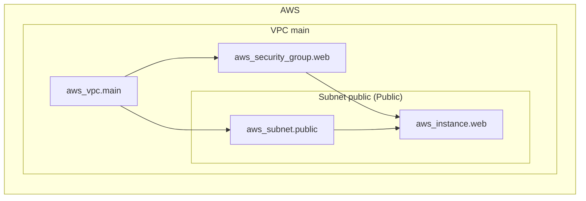

<!-- auto-arch-diagram -->

## Architecture Diagram (Auto)

Summary: Generated a dependency-oriented Terraform diagram from changed resources.

Assumptions: Connections represent inferred references (including depends_on and attribute references).

Rendered diagram: available as workflow artifact
<<<<<<< HEAD

## AI Architecture Insights

*Reviewed by `gemini:gemini-3.1-flash-lite` (quality score: 4/10).*

The architecture implements a robust MLOps lifecycle. Data flows from Kinesis into S3, where Glue jobs perform feature engineering. The Step Functions state machine orchestrates the training pipeline, utilizing EKS for compute-intensive tasks and SageMaker for model hosting. Security is enforced via IAM roles and VPC-level isolation (Private subnets, Security Groups). Scalability is addressed through managed services (EKS, SageMaker, Kinesis). Recommendation: Decouple the 'Security' and 'Other' blocks to reduce visual clutter and improve readability.

**Context hints**
- `[S3]` Data lifecycle managed across raw, processed, and curated buckets with versioning.
- `[KMS]` Centralized encryption key management for all data-at-rest resources.
- `[COMPUTE]` Hybrid compute using EKS for training and Lambda for event-driven orchestration.
- `[NETWORK]` Private subnets with NAT gateway for secure egress and isolated resource access.

**Contextual labels applied:** `eks_cluster` → ML Training Cluster, `sagemaker_domain` → SageMaker Studio Domain, `s3_bucket` → Data Lake Storage, `lambda_function` → Event Processing Lambda, `rds_cluster` → Feature Store DB, `kinesis_stream` → Ingestion Stream (+2 more)

**Review notes**
- [layout] Diagram is overly vertical and cluttered, causing excessive edge overlapping.
- [edge-routing] Security/Access edges (red) cross over data flow lines, creating significant visual noise.
- [grouping] The 'Other' category is a catch-all that lacks logical cohesion.

Feedback iterations: iter0: 4/10, iter1: 4/10, iter2: 4/10

**AI-refined diagram files** (include legend and review hints): architecture-ai.png, architecture-ai.jpg, architecture-ai.svg, architecture-ai.html, architecture-ai.drawio
=======
>>>>>>> origin/main
