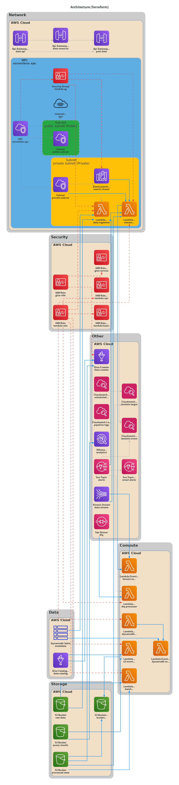
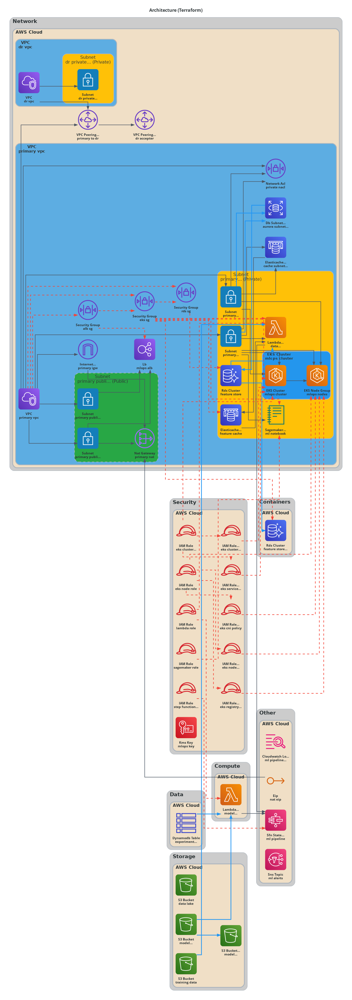
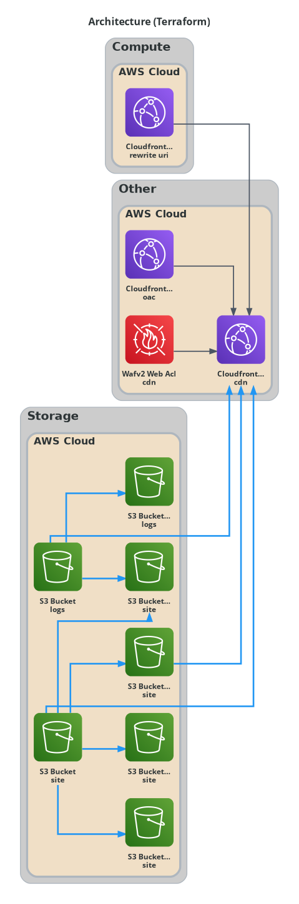
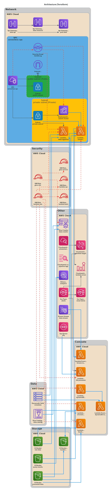
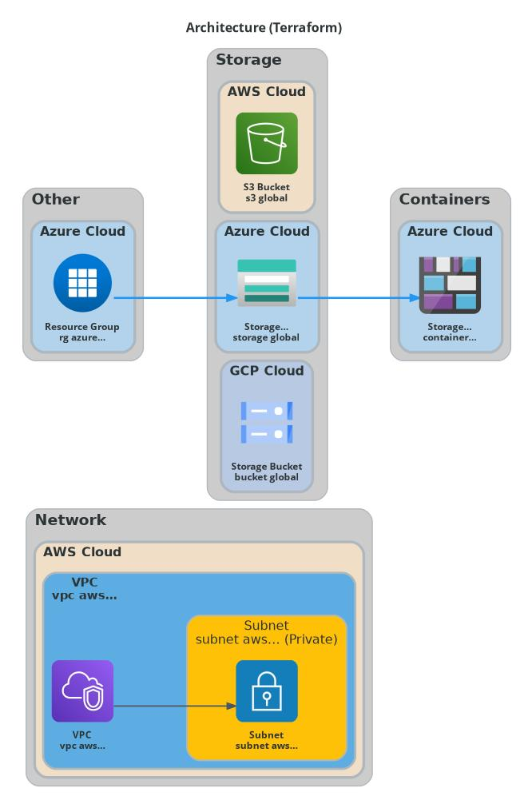
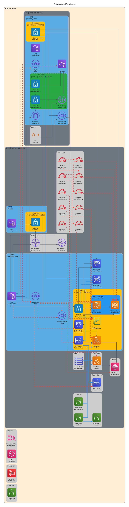
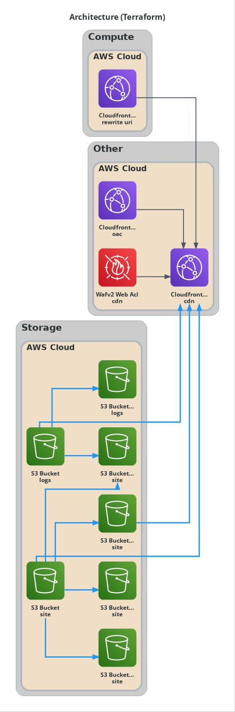
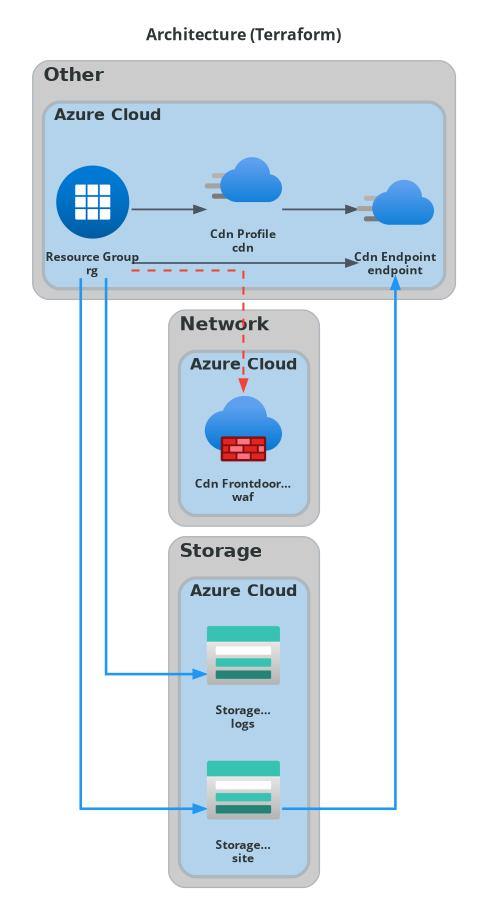
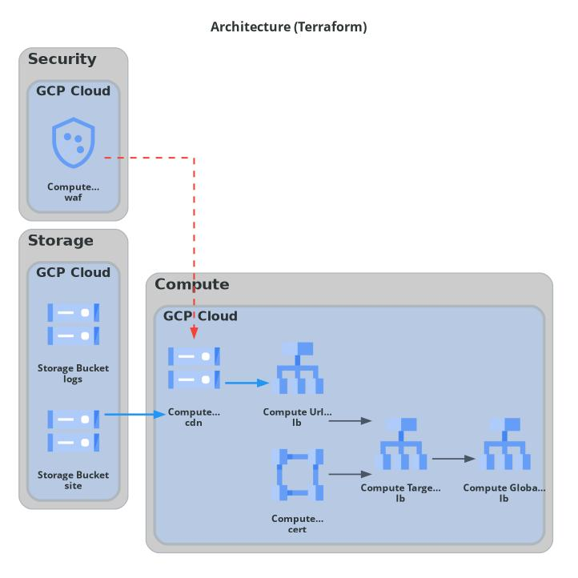

# Architecture Diagram Examples

This directory contains comprehensive examples demonstrating the full capabilities of auto-arch-diagram, from simple serverless architectures to complex event-driven data pipelines with custom icons.

## 🎯 Featured Examples

### Custom Icons Demo

**[terraform/custom-icons-demo/](terraform/custom-icons-demo/)** - Complex serverless data pipeline (40+ resources)



✅ **Custom Icon Support** - 11 specialized icons for domain-specific components  
✅ **VPC Grouping** - Resources organized within VPC with public/private subnet distinction  
✅ **Event-Driven Architecture** - API Gateway → Lambda → Kinesis → ElasticSearch workflow  
✅ **Multiple Data Stores** - S3, DynamoDB, ElasticSearch, Glue Catalog integration  
✅ **Serverless Patterns** - Lambda, Step Functions, EventBridge, SNS/SQS  
✅ **Professional Styling** - White backgrounds, colored borders, center-based edge routing  
✅ **Complex Topology** - Intelligent AUTO layout with no overlaps

---

### MLOps Multi-Cloud

**[terraform/mlops-multi-cloud/](terraform/mlops-multi-cloud/)** - Enterprise MLOps across AWS, Azure, and GCP (47 resources)


✅ **Multi-Cloud Architecture** - AWS SageMaker + Azure AKS + GCP BigQuery  
✅ **Cross-Provider Connectivity** - SNS → Pub/Sub, Container Registry sync  
✅ **Feature Store** - GCP BigQuery with Dataflow processing  
✅ **ML Training** - AWS SageMaker with Step Functions orchestration  
✅ **Model Serving** - Azure AKS cluster with Redis caching  
✅ **Provider-Specific Styling** - AWS orange, Azure blue, GCP colors

---

### MLOps Multi-Region AWS

**[terraform/mlops-multi-region-aws/](terraform/mlops-multi-region-aws/)** - Multi-region DR architecture (46 resources)



✅ **Multi-Region DR** - Primary (us-east-1) + Disaster Recovery (us-west-2)  
✅ **VPC Peering** - Cross-region connectivity  
✅ **EKS Cluster** - Kubernetes for ML workloads  
✅ **Feature Store** - RDS Aurora + ElastiCache Redis  
✅ **ML Pipeline** - Step Functions orchestrating SageMaker + Lambda

---

### Serverless Website (AWS)

**[serverless-website/aws/terraform/](serverless-website/aws/terraform/)** - Simple S3 + CloudFront static hosting



## 📁 All Examples

### Terraform Examples

| Example | Preview | Resources | Features |
|---------|---------|-----------|----------|
| [custom-icons-demo](terraform/custom-icons-demo/) ⭐ |  | 40+ | Custom icons, VPC, event-driven |
| [mlops-multi-cloud](terraform/mlops-multi-cloud/) |  | 47 | AWS + Azure + GCP |
| [mlops-multi-region-aws](terraform/mlops-multi-region-aws/) |  | 46 | Multi-region DR |
| [aws/terraform](serverless-website/aws/terraform/) |  | 8 | S3 + CloudFront |
| [azure/terraform](serverless-website/azure/terraform/) |  | 7 | Storage + CDN |
| [gcp/terraform](serverless-website/gcp/terraform/) |  | 6 | Cloud Storage + CDN |

### Other IaC Examples

| Example | Format | Resources |
|---------|--------|-----------|
| [aws/cloudformation](serverless-website/aws/cloudformation/) | CloudFormation YAML | 8 |
| [azure/bicep](serverless-website/azure/bicep/) | Bicep | 7 |
| [aws/pulumi](serverless-website/aws/pulumi/) | Pulumi YAML | 8 |

## 🎨 Custom Icon Support

See the `custom-icons-demo` example for custom icon integration:

1. **Create Icons**: Place PNG files in [../icons/custom/](../icons/custom/) (64x64+ recommended)
2. **Tag Resources**: Add `Icon = "custom://iconname"` tag to Terraform resources
3. **Auto-Detection**: Tool automatically uses custom icons for tagged resources

**11 Custom Icons Included:** DataPipeline, DataStream, StreamProcessor, EventTrigger, DatabaseStream, SearchEngine, DataCrawler, Scheduler, AlertNotification, MessageQueue, CloudMonitor

See [../icons/custom/README.md](../icons/custom/README.md) for details.

## 🚀 Generating Examples

### Regenerate All Examples

```bash
# From repository root
python tools/regenerate_examples.py
```

### Generate Single Example

```bash
python tools/generate_arch_diagram.py \
  --changed-files examples/terraform/custom-icons-demo/main.tf \
  --direction AUTO \
  --out-md examples/terraform/custom-icons-demo/architecture-diagram.md \
  --out-png examples/terraform/custom-icons-demo/architecture-diagram.png \
  --out-svg examples/terraform/custom-icons-demo/architecture-diagram.svg
```

## 📊 Complexity Comparison

| Example | Resources | VPCs | Subnets | Custom Icons | Edges | Lines |
|---------|-----------|------|---------|--------------|-------|-------|
| custom-icons-demo | 40 | 1 | 2 | 11 | 35+ | 530 |
| serverless/aws/tf | 8 | 0 | 0 | 0 | 5 | 120 |
| serverless/azure/tf | 7 | 0 | 0 | 0 | 4 | 110 |
| serverless/gcp/tf | 6 | 0 | 0 | 0 | 4 | 100 |

## 🏗️ Architecture Patterns

### Event-Driven Architecture
API Gateway triggers, S3 events, DynamoDB streams, EventBridge scheduling

### Data Processing Pipelines
Real-time streaming (Kinesis), batch processing (Lambda), cataloging (Glue), analytics (Athena)

### Serverless Best Practices
VPC configuration, dead letter queues, CloudWatch monitoring, Step Functions orchestration

## 💡 Tips

- Use `AUTO` direction for intelligent layout selection
- Add `Name` tags for better node labels
- Use `Tier = "public"/"private"` tags for subnet classification  
- Create custom icons for domain-specific components
- Keep examples under 50 resources for optimal rendering

## 📝 Technical Notes

- Static parsers support Terraform, CloudFormation, Bicep, Pulumi YAML
- Icon-rendered PNG/SVG/JPEG diagrams are best for Terraform (2,100+ official icons)
- Provider icon mapping: AWS, Azure, GCP, IBM Cloud, Oracle Cloud
- VPC grouping automatically detects network hierarchy
