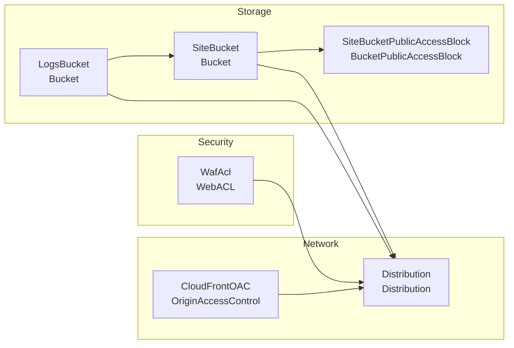

<!-- auto-arch-diagram -->

## Architecture Diagram (Auto)

Summary: Generated a dependency-oriented CloudFormation diagram from changed resources.

Assumptions: Connections represent inferred references via Ref/GetAtt/Sub and DependsOn.

Rendered diagram: not available (icons require Graphviz + diagrams)
