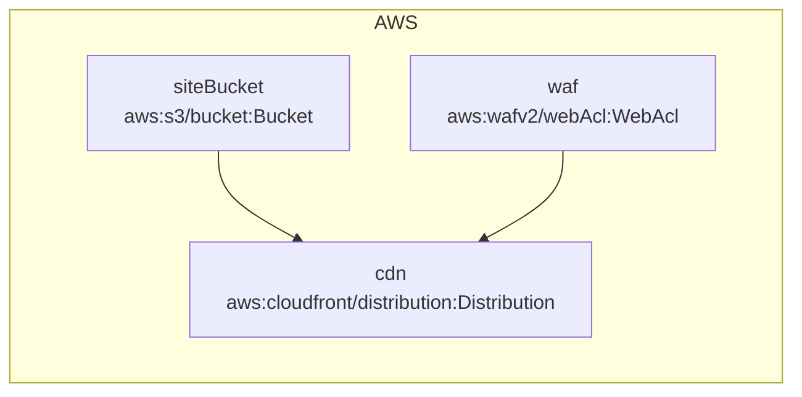

<!-- auto-arch-diagram -->

## Architecture Diagram (Auto)

Summary: Generated a Pulumi YAML diagram from resources and dependsOn/reference expressions.

Assumptions: Connections represent options.dependsOn and ${resource.property} references in YAML.

Rendered diagram: not available (icons require Graphviz + diagrams)
