<!-- auto-arch-diagram -->

## Architecture Diagram (Auto)

Summary: Generated a dependency-oriented Terraform diagram from changed resources.

```mermaid
flowchart LR
  subgraph all_AWS[AWS]
    tf_aws_cloudfront_distribution_cdn["aws_cloudfront_distribution.cdn"]
    tf_aws_cloudfront_function_rewrite_uri["aws_cloudfront_function.rewrite_uri"]
    tf_aws_cloudfront_origin_access_control_oac["aws_cloudfront_origin_access_control.oac"]
    tf_aws_s3_bucket_logs["aws_s3_bucket.logs"]
    tf_aws_s3_bucket_site["aws_s3_bucket.site"]
    tf_aws_s3_bucket_logging_site["aws_s3_bucket_logging.site"]
    tf_aws_s3_bucket_public_access_block_site["aws_s3_bucket_public_access_block.site"]
    tf_aws_s3_bucket_server_side_encryption_configuration_logs["aws_s3_bucket_server_side_encryption_configuration.logs"]
    tf_aws_s3_bucket_server_side_encryption_configuration_site["aws_s3_bucket_server_side_encryption_configuration.site"]
    tf_aws_s3_bucket_versioning_site["aws_s3_bucket_versioning.site"]
    tf_aws_wafv2_web_acl_cdn["aws_wafv2_web_acl.cdn"]
  end
tf_aws_cloudfront_function_rewrite_uri --> tf_aws_cloudfront_distribution_cdn
tf_aws_cloudfront_origin_access_control_oac --> tf_aws_cloudfront_distribution_cdn
tf_aws_s3_bucket_logs --> tf_aws_cloudfront_distribution_cdn
tf_aws_s3_bucket_logs --> tf_aws_s3_bucket_logging_site
tf_aws_s3_bucket_logs --> tf_aws_s3_bucket_server_side_encryption_configuration_logs
tf_aws_s3_bucket_public_access_block_site --> tf_aws_cloudfront_distribution_cdn
tf_aws_s3_bucket_site --> tf_aws_cloudfront_distribution_cdn
tf_aws_s3_bucket_site --> tf_aws_s3_bucket_logging_site
tf_aws_s3_bucket_site --> tf_aws_s3_bucket_public_access_block_site
tf_aws_s3_bucket_site --> tf_aws_s3_bucket_server_side_encryption_configuration_site
tf_aws_s3_bucket_site --> tf_aws_s3_bucket_versioning_site
tf_aws_wafv2_web_acl_cdn --> tf_aws_cloudfront_distribution_cdn
```

Assumptions: Connections represent inferred references (including depends_on and attribute references).

Rendered diagram: available as workflow artifact

## AI Architecture Insights

*Reviewed by OpenRouter free vision model `stealth/ox-alpha` (quality score: 5/10).*

**Architecture**: Terraform-provisioned static site delivery. CloudFront fronts a private, versioned S3 origin, hardened by WAFv2 and an edge URI-rewrite function; Origin Access Control restricts bucket reads to the distribution.

**Dataflow**: (1) viewer requests hit CloudFront; (2) WAF filters exploits; (3) edge function normalizes URIs; (4) OAC-authenticated fetches from site bucket; (5) access logs ship to dedicated log buckets.

**Security**: Public access blocked, SSE on site and log buckets, WAF attached, least-privilege origin auth. No KMS CMKs or explicit TLS-only policy evidenced.

**Scalability**: CDN caching and serverless edge functions scale elastically; origin shielded by cache hits. Gaps: four config resources unrendered, no lifecycle/retention policies, no monitoring or alarm resources defined.

**Context hints**
- `[NETWORK]` CloudFront edge delivery with WAFv2 filtering and URI rewrite at edge
- `[S3]` Private versioned site bucket; public access fully blocked
- `[KMS]` Server-side encryption defaults on site and log buckets
- `[DATA]` Access logs consolidated into dedicated logging bucket for retention
- `[IAM]` Origin Access Control restricts bucket reads to distribution only
- `[COMPUTE]` Lightweight edge function executes on every viewer request

**Contextual labels applied:** `cdn` → Global CDN Distribution, `rewrite_uri` → Edge URI Rewriter, `oac` → Origin Access Control, `site` → Static Site Bucket, `logs` → Delivery Logs Bucket, `logging_site` → Site Access Logging (+5 more)

**Review notes**
- [completeness] Only 7 of 11 inventory resources rendered; public access block, both SSE configurations, and versioning are missing from the diagram
- [labeling] Truncated labels 'Cloudfront... cdn' and 'Cloudfront Origin... oac' obscure resource identity
- [grouping] CDN distribution, OAC, and WAF are placed in a generic 'Other' cluster instead of a semantic edge/security group
- [edge-routing] Long site-to-CDN edge traverses the Storage cluster and crosses multiple connectors, creating visual noise
- [edge-routing] logs-to-CDN arrow direction contradicts semantics: CloudFront writes logs to the bucket, not the reverse

Feedback iterations: iter0: 5/10, iter1: 5/10, iter2: 5/10

**AI-refined diagram files** (include legend and review hints): architecture-diagram-ai.png, architecture-diagram-ai.jpg, architecture-diagram-ai.svg, architecture-diagram-ai.html, architecture-diagram-ai.drawio
