<!-- auto-arch-diagram -->

## Architecture Diagram (Auto)

Summary: Generated a dependency-oriented Terraform diagram from changed resources.

```mermaid
flowchart LR
  subgraph all_AWS[AWS]
    tf_aws_cloudfront_distribution_cdn["aws_cloudfront_distribution.cdn"]
    tf_aws_cloudfront_function_rewrite_uri["aws_cloudfront_function.rewrite_uri"]
    tf_aws_cloudfront_origin_access_control_oac["aws_cloudfront_origin_access_control.oac"]
    tf_aws_s3_bucket_logs["aws_s3_bucket.logs"]
    tf_aws_s3_bucket_site["aws_s3_bucket.site"]
    tf_aws_s3_bucket_logging_site["aws_s3_bucket_logging.site"]
    tf_aws_s3_bucket_public_access_block_site["aws_s3_bucket_public_access_block.site"]
    tf_aws_s3_bucket_server_side_encryption_configuration_logs["aws_s3_bucket_server_side_encryption_configuration.logs"]
    tf_aws_s3_bucket_server_side_encryption_configuration_site["aws_s3_bucket_server_side_encryption_configuration.site"]
    tf_aws_s3_bucket_versioning_site["aws_s3_bucket_versioning.site"]
    tf_aws_wafv2_web_acl_cdn["aws_wafv2_web_acl.cdn"]
  end
tf_aws_cloudfront_function_rewrite_uri --> tf_aws_cloudfront_distribution_cdn
tf_aws_cloudfront_origin_access_control_oac --> tf_aws_cloudfront_distribution_cdn
tf_aws_s3_bucket_logs --> tf_aws_cloudfront_distribution_cdn
tf_aws_s3_bucket_logs --> tf_aws_s3_bucket_logging_site
tf_aws_s3_bucket_logs --> tf_aws_s3_bucket_server_side_encryption_configuration_logs
tf_aws_s3_bucket_public_access_block_site --> tf_aws_cloudfront_distribution_cdn
tf_aws_s3_bucket_site --> tf_aws_cloudfront_distribution_cdn
tf_aws_s3_bucket_site --> tf_aws_s3_bucket_logging_site
tf_aws_s3_bucket_site --> tf_aws_s3_bucket_public_access_block_site
tf_aws_s3_bucket_site --> tf_aws_s3_bucket_server_side_encryption_configuration_site
tf_aws_s3_bucket_site --> tf_aws_s3_bucket_versioning_site
tf_aws_wafv2_web_acl_cdn --> tf_aws_cloudfront_distribution_cdn
```

Assumptions: Connections represent inferred references (including depends_on and attribute references).

Rendered diagram: available as workflow artifact

## AI Architecture Insights

*Reviewed by OpenRouter free vision model `stealth/ox-alpha` (quality score: 5/10).*

**End-to-end flow:** viewer → WAF (`wafv2_web_acl_cdn`) → CloudFront (`cdn`) → OAC → private S3 origin (`site`).

- `site` bucket stores static assets; `public_access_block` keeps it private, `oac` grants CDN-only read.
- `rewrite_uri` CloudFront function rewrites viewer request URIs at the edge.
- `versioning.site` enables object recovery; SSE configurations encrypt `site` and `logs` at rest.
- Access logs from both `site` and `cdn` centralize into the `logs` bucket via `logging.site`.

Overall: a hardened, encrypted, versioned static-site delivery stack with centralized access logging.

**Context hints**
- `[S3]` site bucket stores static assets; served privately via OAC through cdn
- `[COMPUTE]` rewrite_uri function rewrites viewer request URIs at CloudFront edge
- `[NETWORK]` wafv2_web_acl_cdn inspects and filters CDN traffic before origin fetch
- `[DATA]` logs bucket receives access logs from site bucket and cdn
- `[IAM]` public_access_block keeps site bucket private; OAC grants cdn read access
- `[DATA]` versioning and SSE configs enforce retention and encryption on site bucket

**Contextual labels applied:** `cloudfront_distribution.cdn` → CDN Distribution (WAF-Protected), `cloudfront_function.rewrite_uri` → Edge URL Rewrite Function, `cloudfront_origin_access_control.oac` → Origin Access Control (OAC), `s3_bucket.site` → Static Site Origin Bucket, `s3_bucket.logs` → Central Access Logs Bucket, `s3_bucket_logging.site` → Site Access Logging Config (+5 more)

**Review notes**
- [labeling] Truncated labels ('Cloudfront Origin...', 'S3 Bucket Server...', 'S3 Bucket Public...') hide resource identity and purpose.
- [grouping] CloudFront function isolated in 'Compute' while its distribution, WAF, and OAC sit in 'Other'; splits one delivery path across groups.
- [edge-routing] Six long parallel edges from Storage to CDN span the full canvas, creating visual noise and ambiguity.
- [completeness] Terraform dependency edges rendered as data flows; logs bucket does not actually send traffic to the CDN.
- [layout] Redundant nested 'AWS Cloud' containers inside each group waste space and add border clutter.

Feedback iterations: iter0: 5/10, iter1: 4/10, iter2: 5/10

**AI-refined diagram files** (include legend and review hints): architecture-diagram-ai.png, architecture-diagram-ai.jpg, architecture-diagram-ai.svg
