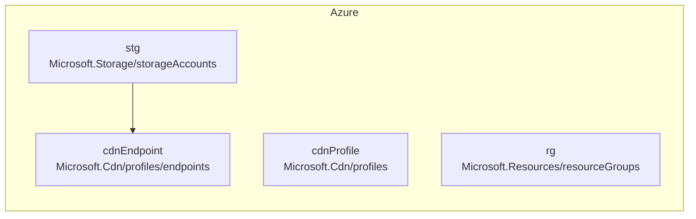

<!-- auto-arch-diagram -->

## Architecture Diagram (Auto)

Summary: Generated a best-effort Bicep dependency diagram (dependsOn/parent).

Assumptions: Connections represent explicit dependsOn/parent references; implicit property references are not fully resolved.

Rendered diagram: not available (icons require Graphviz + diagrams)
