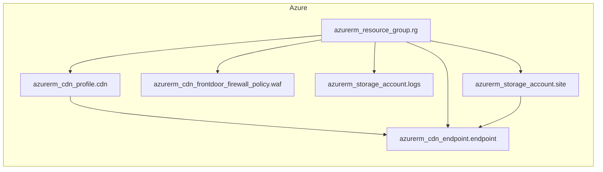

<!-- auto-arch-diagram -->

## Architecture Diagram (Auto)

Summary: Generated a dependency-oriented Terraform diagram from changed resources.

Assumptions: Connections represent inferred references (including depends_on and attribute references).

Rendered diagram: available as workflow artifact

## AI Architecture Insights

*Reviewed by OpenRouter free vision model `stealth/ox-alpha` (quality score: 5/10).*

**End-to-end:** A static-site delivery stack on Azure. `rg` contains all resources. `site` (storage account) hosts static web assets and acts as the origin for `cdn_endpoint`, which is managed under `cdn_profile` for global low-latency distribution. `waf` (Front Door firewall policy) filters malicious HTTP/S traffic before it reaches the CDN edge. `logs` is a dedicated storage account receiving diagnostic/access logs for auditing and troubleshooting. Flow: user → WAF → CDN endpoint → site origin; telemetry → logs.

**Context hints**
- `[NETWORK]` cdn_endpoint serves static content using site storage account as origin.
- `[DATA]` site hosts static website assets distributed globally via CDN.
- `[DATA]` logs stores diagnostic and access logs exported from CDN services.
- `[NETWORK]` waf applies managed firewall rules protecting CDN-fronted web traffic.
- `[NETWORK]` cdn_profile centralizes endpoint configuration, origins, and delivery rules.
- `[GENERAL]` rg scopes deployment, billing, and RBAC for all five resources.

**Contextual labels applied:** `rg` → Deployment Scope (All Resources), `cdn` → CDN Delivery Profile, `endpoint` → Public Static Entry, `waf` → WAF Protection Layer, `logs` → Diagnostics Log Account, `site` → Static Site Origin

**Review notes**
- [edge-routing] Resource group fan-out produces long blue edges spanning the full canvas.
- [labeling] Truncated/wrapped labels: 'Cdn Frontdoor...' and 'waf' split across lines.
- [grouping] CDN profile and endpoint sit under 'Other' instead of a dedicated CDN group.
- [layout] Red dashed rg→waf edge cuts vertically through the diagram center.
- [completeness] No visual association between waf and endpoint despite Front Door WAF semantics.

Feedback iterations: iter0: 5/10, iter1: 5/10, iter2: 5/10

**AI-refined diagram files** (include legend and review hints): architecture-diagram-ai.png, architecture-diagram-ai.jpg, architecture-diagram-ai.svg
