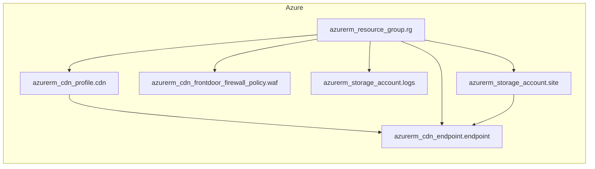

<!-- auto-arch-diagram -->

## Architecture Diagram (Auto)

Summary: Generated a dependency-oriented Terraform diagram from changed resources.

Assumptions: Connections represent inferred references (including depends_on and attribute references).

Rendered diagram: available as workflow artifact

## AI Architecture Insights

*Reviewed by OpenRouter free vision model `stealth/ox-alpha` (quality score: 6/10).*

**Architecture**: Azure static-site delivery platform — storage-hosted web content fronted by a CDN endpoint and protected by a Front Door WAF policy, all governed by one resource group.

**Dataflow**: (1) Resources provision into the resource group; (2) CDN profile registers the endpoint; (3) site storage binds as origin; (4) edge nodes cache and serve content globally; (5) diagnostics flow to the logs account.

**Security**: WAF filters OWASP threats at the edge; enforce HTTPS-only delivery, TLS 1.2+, storage encryption at rest, and least-privilege RBAC scoped to the resource group.

**Scalability**: Edge caching absorbs traffic spikes and minimizes origin load; storage scales elastically. Add custom domains, managed certificates, and log-driven alerting for production hardening.

**Context hints**
- `[NETWORK]` Front Door WAF inspects edge traffic before origin fetch
- `[DATA]` Site storage serves static content; logs account captures diagnostics
- `[GENERAL]` Resource group scopes RBAC, tagging, and lifecycle for all resources
- `[DATA]` Enable lifecycle rules to expire stale logs and control retention
- `[NETWORK]` CDN endpoint caches globally, cutting latency and origin load

**Contextual labels applied:** `waf` → Front Door WAF Policy, `logs` → Diagnostic Logs Storage, `site` → Static Site Origin, `rg` → Platform Resource Group, `cdn` → CDN Profile, `endpoint` → Global Delivery Endpoint

**Review notes**
- [labeling] WAF node label truncated to 'Cdn Frontdoor...' hiding full resource identity
- [grouping] 'Other' cluster is a catch-all mixing governance (resource group) with serving resources (CDN profile/endpoint)
- [edge-routing] Five dependency edges fan out from the resource group, overlapping near the node and crossing group boundaries
- [labeling] Raw terraform suffixes (rg, cdn, waf, endpoint) rendered as secondary labels add noise
- [completeness] No client/internet entry point or request-path arrow showing user traffic through WAF to endpoint

Feedback iterations: iter0: 6/10, iter1: 6/10, iter2: 6/10

**AI-refined diagram files** (include legend and review hints): architecture-diagram-ai.png, architecture-diagram-ai.jpg, architecture-diagram-ai.svg, architecture-diagram-ai.html, architecture-diagram-ai.drawio
