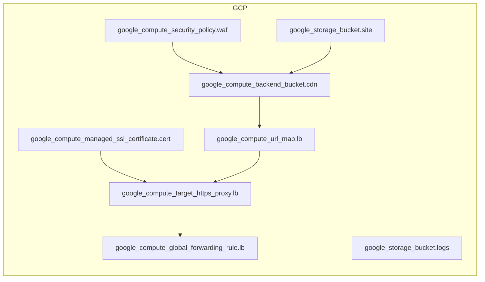

<!-- auto-arch-diagram -->

## Architecture Diagram (Auto)

Summary: Generated a dependency-oriented Terraform diagram from changed resources.

Assumptions: Connections represent inferred references (including depends_on and attribute references).

Rendered diagram: available as workflow artifact

## AI Architecture Insights

*Reviewed by OpenRouter free vision model `stealth/ox-alpha` (quality score: 6/10).*

**Architecture** — GCP global external HTTPS LB stack (forwarding rule → HTTPS proxy → URL map → CDN backend bucket) serves static content from Cloud Storage, fronted by Cloud Armor WAF and a managed SSL certificate; a dedicated bucket collects access logs.

**Dataflow** — 1) Anycast IP receives TLS traffic; 2) proxy terminates TLS with the managed cert; 3) URL map routes to the CDN backend; 4) edge cache serves hits, misses fetch from the site bucket; 5) WAF evaluates requests pre-origin; logs stream to the logs bucket.

**Security** — TLS termination with auto-renewing managed cert and Cloud Armor L7 filtering; recommend uniform bucket-level access, public-access prevention, and explicit log retention.

**Scalability** — Global anycast plus CDN absorbs traffic spikes; the stateless edge tier scales horizontally with no origin changes.

**Context hints**
- `[COMPUTE]` Global HTTPS load balancer terminates TLS via managed certificate and routes via URL map
- `[NETWORK]` Cloud Armor WAF filters requests at the edge before origin fetch
- `[DATA]` Static assets served from storage bucket through CDN-enabled backend bucket
- `[DATA]` Access logs exported to dedicated bucket; define lifecycle retention for audit
- `[COMPUTE]` CDN edge caching offloads origin, cutting latency and egress cost
- `[GENERAL]` Edges show Terraform dependency order, not live request direction

**Contextual labels applied:** `global_forwarding_rule` → Global Anycast Entry, `target_https_proxy` → HTTPS Proxy Termination, `cert` → Managed SSL Certificate, `url_map` → Request Routing Map, `cdn` → CDN Backend Bucket, `waf` → Cloud Armor WAF Policy (+2 more)

**Review notes**
- [labeling] Five node labels are truncated with ellipses (Compute Security…, Compute Backend…, Compute Managed Ssl…, Compute Target Http…, Compute Global…), obscuring resource identity.
- [edge-routing] site bucket → CDN edge takes a long orthogonal detour crossing Storage and Compute group boundaries; the WAF dashed edge also crosses groups.
- [completeness] No client entry node or request-direction indicator; edges encode Terraform dependencies (reverse of request path); logs bucket shows no log-flow edge.
- [layout] Large empty region in the bottom-right of the GCP Cloud group; composition is left-weighted.
- [grouping] WAF sits in a separate Security subgroup though it attaches to the CDN backend bucket in Compute, creating semantic distance.

Feedback iterations: iter0: 6/10

**AI-refined diagram files** (include legend and review hints): architecture-diagram-ai.png, architecture-diagram-ai.jpg, architecture-diagram-ai.svg, architecture-diagram-ai.html, architecture-diagram-ai.drawio
