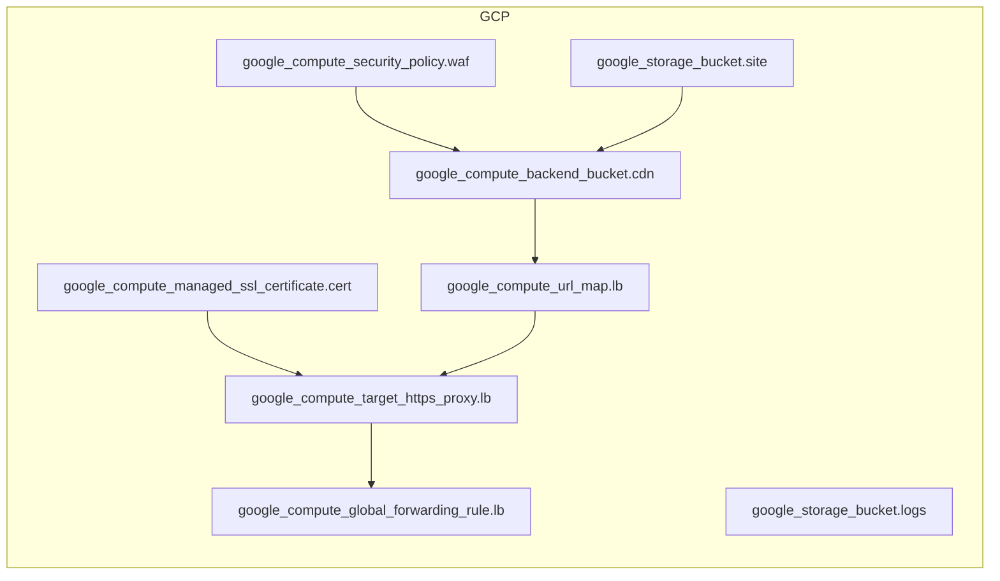

<!-- auto-arch-diagram -->

## Architecture Diagram (Auto)

Summary: Generated a dependency-oriented Terraform diagram from changed resources.

Assumptions: Connections represent inferred references (including depends_on and attribute references).

Rendered diagram: available as workflow artifact

## AI Architecture Insights

*Reviewed by OpenRouter free vision model `stealth/ox-alpha` (quality score: 6/10).*

**Static site delivery on GCP, fully serverless.** Users hit `global_forwarding_rule.lb` on :443; `target_https_proxy.lb` terminates TLS with `managed_ssl_certificate.cert`; `url_map.lb` forwards to `backend_bucket.cdn`, which serves and edge-caches objects from `google_storage_bucket.site`. `google_compute_security_policy.waf` (Cloud Armor) filters requests at the backend bucket before cache fill. `google_storage_bucket.logs` receives site access logs for audit and retention. No VM instances: object storage plus CDN, WAF, and global HTTPS load balancing.

**Context hints**
- `[S3]` Bucket site stores static site assets; backend_bucket.cdn serves them via Cloud CDN.
- `[S3]` Bucket logs collects access logs emitted by bucket site.
- `[NETWORK]` Security policy waf applies Cloud Armor rules to backend_bucket.cdn traffic.
- `[NETWORK]` Url map lb routes incoming request paths to backend_bucket.cdn.
- `[NETWORK]` Target https proxy lb terminates TLS using managed_ssl_certificate.cert.
- `[NETWORK]` Global forwarding rule lb publishes proxy on anycast IP port 443.

**Contextual labels applied:** `cdn` → CDN Backend For Site, `waf` → Cloud Armor WAF Policy, `site` → Static Site Content, `logs` → Access Log Archive, `cert` → Managed TLS Certificate, `url_map.lb` → Path Routing Rules (+2 more)

**Review notes**
- [labeling] Four node labels truncated (Compute Security..., Compute Backend..., Compute Target Http..., Compute Global...), hiding resource identity.
- [labeling] Three distinct resources share display name 'lb' (url map, https proxy, forwarding rule); roles indistinguishable.
- [edge-routing] waf-to-cdn edge makes a long vertical detour through empty space instead of hugging group boundary.
- [grouping] Redundant nested 'GCP Cloud' subgraph inside every top-level group adds noise without information.
- [layout] cert sits below the main flow axis; its edge converges on proxy alongside url_map edge, causing local congestion.

Feedback iterations: iter0: 5/10, iter1: 6/10, iter2: 5/10, iter3: 6/10

**AI-refined diagram files** (include legend and review hints): architecture-diagram-ai.png, architecture-diagram-ai.jpg, architecture-diagram-ai.svg
