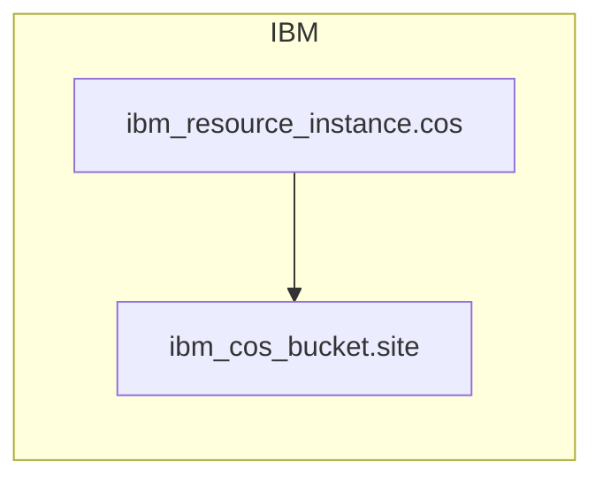

<!-- auto-arch-diagram -->

## Architecture Diagram (Auto)

Summary: Generated a dependency-oriented Terraform diagram from changed resources.

Assumptions: Connections represent inferred references (including depends_on and attribute references).

Rendered diagram: available as workflow artifact

## AI Architecture Insights

*Reviewed by OpenRouter free vision model `stealth/ox-alpha` (quality score: 7/10).*

Terraform provisions an IBM Cloud Object Storage service instance (`ibm_resource_instance.cos`) and a single bucket (`ibm_cos_bucket.site`) intended for static site hosting. The bucket depends on the service instance for capacity, billing, and lifecycle management. No compute, networking, IAM, or KMS resources appear, so access control, encryption configuration, and content delivery are unrepresented. End-to-end, this is a minimal static-asset store with no depicted consumers or producers.

**Context hints**
- `[GENERAL]` ibm_resource_instance.cos provisions IBM Cloud Object Storage capacity and billing for buckets.
- `[S3]` ibm_cos_bucket.site stores static website assets for direct public serving.
- `[GENERAL]` Bucket site hard-depends on instance cos; deleting instance orphans bucket.
- `[KMS]` No KMS key encrypts site; provider-default encryption applies.
- `[IAM]` No IAM policies shown restricting access to bucket site.

**Contextual labels applied:** `ibm_resource_instance.cos` → Object Storage Service, `ibm_cos_bucket.site` → Static Site Bucket

**Review notes**
- [grouping] COS service instance placed under Compute group despite being a storage service.
- [completeness] Only two resources rendered; no IAM, KMS, or delivery context included.

Feedback iterations: iter0: 7/10

**AI-refined diagram files** (include legend and review hints): architecture-diagram-ai.png, architecture-diagram-ai.jpg, architecture-diagram-ai.svg
