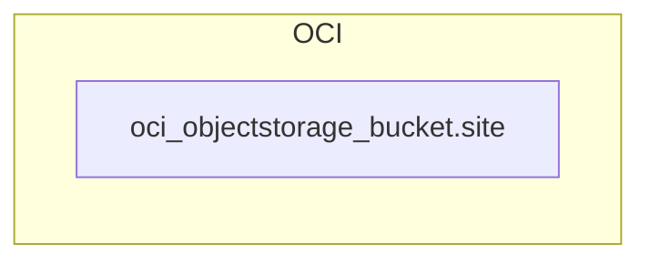

<!-- auto-arch-diagram -->

## Architecture Diagram (Auto)

Summary: Generated a dependency-oriented Terraform diagram from changed resources.

Assumptions: No explicit references found; connections are heuristic to show grouping.

Rendered diagram: available as workflow artifact

## AI Architecture Insights

*Reviewed by OpenRouter free vision model `stealth/ox-alpha` (quality score: 5/10).*

**Architecture Summary:** The IaC declares a single OCI Object Storage bucket (`site`) inside an OCI Cloud boundary. No compute, networking, IAM, or KMS resources are rendered, and the graph contains zero edges.

**Dataflow Stages:** No explicit flows exist. The implied lifecycle is content upload → bucket persistence → (undeclared) consumer delivery. The legend anticipates data-flow, dependency, and security connectors that the current topology does not exercise.

**Security Posture:** OCI Object Storage encrypts at rest with Oracle-managed keys by default; customer-managed KMS keys, versioning, and retention rules are undeclared. Access should be constrained via OCI IAM and private endpoints — none shown.

**Scalability:** Object storage scales elastically; platform scalability is bounded by missing CDN/compute tiers, not the bucket.

**Context hints**
- `[DATA]` Durable object storage for site assets with elastic capacity
- `[KMS]` Encrypted at rest by default; no customer-managed KMS key declared
- `[IAM]` Bucket access governed by OCI IAM policies; none rendered
- `[GENERAL]` Single-resource topology; zero edges, no compute or network declared

**Contextual labels applied:** `site` → Site Content Bucket, `objectstorage_bucket` → Object Storage Service

**Review notes**
- [completeness] Only one resource rendered; legend advertises data-flow, dependency, and security connectors but the graph has zero edges.
- [labeling] Node label exposes the raw resource name 'site' instead of a human-friendly contextual name.
- [layout] Vast empty canvas around a lone node yields poor information density and unbalanced composition.
- [grouping] Legend block visually dominates the diagram, outweighing the actual infrastructure content.

Feedback iterations: iter0: 5/10, iter1: 3/10, iter2: 3/10

**AI-refined diagram files** (include legend and review hints): architecture-diagram-ai.png, architecture-diagram-ai.jpg, architecture-diagram-ai.svg, architecture-diagram-ai.html, architecture-diagram-ai.drawio
