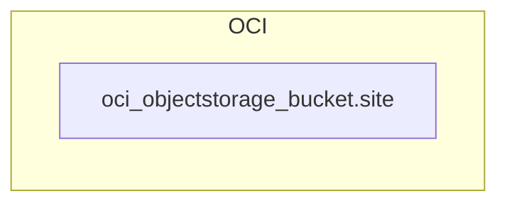

<!-- auto-arch-diagram -->

## Architecture Diagram (Auto)

Summary: Generated a dependency-oriented Terraform diagram from changed resources.

Assumptions: No explicit references found; connections are heuristic to show grouping.

Rendered diagram: available as workflow artifact

## AI Architecture Insights

*Reviewed by OpenRouter free vision model `stealth/ox-alpha` (quality score: 6/10).*

**What it does:** Provisions one OCI Object Storage bucket (`site`) as a standalone storage layer, presumably for static site assets.

**Flow:** No edges exist — no CI job publishes objects, no web tier or CDN reads them, so all access would occur directly against OCI's public object-storage API with externally managed credentials.

**Gaps:** No IAM policy, KMS key, lifecycle rule, versioning, or replication is declared; encryption defaults to Oracle-managed keys. The stack is a minimal storage foundation awaiting a publisher, serving tier, and access controls.

**Context hints**
- `[DATA]` site bucket holds static web assets; no producer or consumer defined.
- `[GENERAL]` No versioning, lifecycle, or retention rules declared for site bucket.
- `[KMS]` site uses default Oracle-managed encryption; no customer KMS key attached.
- `[IAM]` No IAM policy grants any principal access to site objects.
- `[NETWORK]` site served over public OCI endpoint; no VCN or gateway linked.
- `[COMPUTE]` No compute tier uploads builds or serves site content yet.

**Contextual labels applied:** `site` → Static Site Bucket

**Review notes**
- [grouping] Triple nesting (Architecture > Storage > OCI Cloud > bucket) adds no information; intermediate boxes redundant for one resource.
- [labeling] Node renders raw terraform address oci_objectstorage_bucket.site instead of a friendly bucket name.
- [layout] Canvas oversized for a single node; large empty margins dilute focus.
- [completeness] Zero edges in inventory; diagram conveys no data flow or dependency structure.

Feedback iterations: iter0: 6/10, iter1: 6/10, iter2: 6/10

**AI-refined diagram files** (include legend and review hints): architecture-diagram-ai.png, architecture-diagram-ai.jpg, architecture-diagram-ai.svg
