<!-- auto-arch-diagram -->

## Architecture Diagram (Auto)

Summary: Generated a dependency-oriented Terraform diagram from changed resources.

```mermaid
flowchart LR
subgraph all_AWS[AWS]
  tf_aws_cloudwatch_event_rule_data_ingestion_schedule["aws_cloudwatch_event_rule.data_ingestion_schedule"]
  tf_aws_cloudwatch_event_target_data_ingestion["aws_cloudwatch_event_target.data_ingestion"]
  tf_aws_cloudwatch_log_group_glue_logs["aws_cloudwatch_log_group.glue_logs"]
  tf_aws_cloudwatch_log_group_lambda_logs["aws_cloudwatch_log_group.lambda_logs"]
  tf_aws_glue_catalog_database_data_pipeline["aws_glue_catalog_database.data_pipeline"]
  tf_aws_glue_job_etl_job["aws_glue_job.etl_job"]
  tf_aws_iam_role_eventbridge_role["aws_iam_role.eventbridge_role"]
  tf_aws_iam_role_glue_role["aws_iam_role.glue_role"]
  tf_aws_iam_role_lambda_role["aws_iam_role.lambda_role"]
  tf_aws_iam_role_policy_eventbridge_lambda_invoke["aws_iam_role_policy.eventbridge_lambda_invoke"]
  tf_aws_iam_role_policy_glue_s3_access["aws_iam_role_policy.glue_s3_access"]
  tf_aws_iam_role_policy_lambda_s3_access["aws_iam_role_policy.lambda_s3_access"]
  tf_aws_iam_role_policy_attachment_glue_service_role["aws_iam_role_policy_attachment.glue_service_role"]
  tf_aws_iam_role_policy_attachment_lambda_basic_execution["aws_iam_role_policy_attachment.lambda_basic_execution"]
  tf_aws_lambda_event_source_mapping_data_processing["aws_lambda_event_source_mapping.data_processing"]
  tf_aws_lambda_event_source_mapping_data_transformation["aws_lambda_event_source_mapping.data_transformation"]
  tf_aws_lambda_function_data_ingestion["aws_lambda_function.data_ingestion"]
  tf_aws_lambda_function_data_processing["aws_lambda_function.data_processing"]
  tf_aws_lambda_function_data_transformation["aws_lambda_function.data_transformation"]
  tf_aws_lambda_permission_allow_eventbridge["aws_lambda_permission.allow_eventbridge"]
  tf_aws_s3_bucket_data_lake["aws_s3_bucket.data_lake"]
  tf_aws_s3_bucket_data_sources["aws_s3_bucket.data_sources"]
  tf_aws_s3_bucket_processed_data["aws_s3_bucket.processed_data"]
  tf_aws_s3_bucket_raw_data["aws_s3_bucket.raw_data"]
  tf_aws_s3_bucket_versioning_all["aws_s3_bucket_versioning.all"]
  tf_aws_sns_topic_data_ingestion["aws_sns_topic.data_ingestion"]
  tf_aws_sns_topic_processing_events["aws_sns_topic.processing_events"]
  tf_aws_sns_topic_transformation_events["aws_sns_topic.transformation_events"]
  tf_aws_sns_topic_subscription_processing_to_queue["aws_sns_topic_subscription.processing_to_queue"]
  tf_aws_sns_topic_subscription_transformation_to_queue["aws_sns_topic_subscription.transformation_to_queue"]
  tf_aws_sqs_queue_data_ingestion_dlq["aws_sqs_queue.data_ingestion_dlq"]
  tf_aws_sqs_queue_data_processing_queue["aws_sqs_queue.data_processing_queue"]
  tf_aws_sqs_queue_data_transformation_queue["aws_sqs_queue.data_transformation_queue"]
  tf_aws_sqs_queue_policy_data_processing["aws_sqs_queue_policy.data_processing"]
  tf_aws_sqs_queue_policy_data_transformation["aws_sqs_queue_policy.data_transformation"]
end
tf_aws_cloudwatch_event_rule_data_ingestion_schedule --> tf_aws_cloudwatch_event_target_data_ingestion
tf_aws_cloudwatch_event_rule_data_ingestion_schedule --> tf_aws_lambda_permission_allow_eventbridge
tf_aws_iam_role_eventbridge_role --> tf_aws_cloudwatch_event_target_data_ingestion
tf_aws_iam_role_eventbridge_role --> tf_aws_iam_role_policy_eventbridge_lambda_invoke
tf_aws_iam_role_glue_role --> tf_aws_glue_job_etl_job
tf_aws_iam_role_glue_role --> tf_aws_iam_role_policy_attachment_glue_service_role
tf_aws_iam_role_glue_role --> tf_aws_iam_role_policy_glue_s3_access
tf_aws_iam_role_lambda_role --> tf_aws_iam_role_policy_attachment_lambda_basic_execution
tf_aws_iam_role_lambda_role --> tf_aws_iam_role_policy_lambda_s3_access
tf_aws_iam_role_lambda_role --> tf_aws_lambda_function_data_ingestion
tf_aws_iam_role_lambda_role --> tf_aws_lambda_function_data_processing
tf_aws_iam_role_lambda_role --> tf_aws_lambda_function_data_transformation
tf_aws_iam_role_policy_lambda_s3_access --> tf_aws_lambda_event_source_mapping_data_processing
tf_aws_iam_role_policy_lambda_s3_access --> tf_aws_lambda_event_source_mapping_data_transformation
tf_aws_lambda_function_data_ingestion --> tf_aws_cloudwatch_event_target_data_ingestion
tf_aws_lambda_function_data_ingestion --> tf_aws_iam_role_policy_eventbridge_lambda_invoke
tf_aws_lambda_function_data_ingestion --> tf_aws_lambda_permission_allow_eventbridge
tf_aws_lambda_function_data_processing --> tf_aws_lambda_event_source_mapping_data_processing
tf_aws_lambda_function_data_transformation --> tf_aws_lambda_event_source_mapping_data_transformation
tf_aws_s3_bucket_data_lake --> tf_aws_iam_role_policy_glue_s3_access
tf_aws_s3_bucket_data_lake --> tf_aws_iam_role_policy_lambda_s3_access
tf_aws_s3_bucket_data_lake --> tf_aws_lambda_function_data_transformation
tf_aws_s3_bucket_data_lake --> tf_aws_s3_bucket_versioning_all
tf_aws_s3_bucket_data_sources --> tf_aws_glue_job_etl_job
tf_aws_s3_bucket_data_sources --> tf_aws_iam_role_policy_lambda_s3_access
tf_aws_s3_bucket_data_sources --> tf_aws_s3_bucket_versioning_all
tf_aws_s3_bucket_processed_data --> tf_aws_iam_role_policy_glue_s3_access
tf_aws_s3_bucket_processed_data --> tf_aws_iam_role_policy_lambda_s3_access
tf_aws_s3_bucket_processed_data --> tf_aws_lambda_function_data_processing
tf_aws_s3_bucket_processed_data --> tf_aws_s3_bucket_versioning_all
tf_aws_s3_bucket_raw_data --> tf_aws_iam_role_policy_glue_s3_access
tf_aws_s3_bucket_raw_data --> tf_aws_iam_role_policy_lambda_s3_access
tf_aws_s3_bucket_raw_data --> tf_aws_lambda_function_data_ingestion
tf_aws_s3_bucket_raw_data --> tf_aws_s3_bucket_versioning_all
tf_aws_sns_topic_processing_events --> tf_aws_iam_role_policy_lambda_s3_access
tf_aws_sns_topic_processing_events --> tf_aws_lambda_function_data_ingestion
tf_aws_sns_topic_processing_events --> tf_aws_sns_topic_subscription_processing_to_queue
tf_aws_sns_topic_processing_events --> tf_aws_sqs_queue_policy_data_processing
tf_aws_sns_topic_transformation_events --> tf_aws_iam_role_policy_lambda_s3_access
tf_aws_sns_topic_transformation_events --> tf_aws_lambda_function_data_processing
tf_aws_sns_topic_transformation_events --> tf_aws_sns_topic_subscription_transformation_to_queue
tf_aws_sns_topic_transformation_events --> tf_aws_sqs_queue_policy_data_transformation
tf_aws_sqs_queue_data_ingestion_dlq --> tf_aws_sqs_queue_data_processing_queue
tf_aws_sqs_queue_data_processing_queue --> tf_aws_iam_role_policy_lambda_s3_access
tf_aws_sqs_queue_data_processing_queue --> tf_aws_lambda_event_source_mapping_data_processing
tf_aws_sqs_queue_data_processing_queue --> tf_aws_sns_topic_subscription_processing_to_queue
tf_aws_sqs_queue_data_processing_queue --> tf_aws_sqs_queue_policy_data_processing
tf_aws_sqs_queue_data_transformation_queue --> tf_aws_iam_role_policy_lambda_s3_access
tf_aws_sqs_queue_data_transformation_queue --> tf_aws_lambda_event_source_mapping_data_transformation
tf_aws_sqs_queue_data_transformation_queue --> tf_aws_sns_topic_subscription_transformation_to_queue
tf_aws_sqs_queue_data_transformation_queue --> tf_aws_sqs_queue_policy_data_transformation
```

Assumptions: Connections represent inferred references (including depends_on and attribute references).

Rendered diagram: available as workflow artifact

## AI Architecture Insights

*Reviewed by OpenRouter free vision model `stealth/ox-alpha` (quality score: 3/10).*

**End-to-end:** an EventBridge schedule invokes `data_ingestion`, landing files from `data_sources` into `raw_data`. SNS topics `processing_events` / `transformation_events` fan out to SQS queues whose event source mappings trigger `data_processing` and `data_transformation`, writing results to `processed_data`; failures drain to `data_ingestion_dlq`. The Glue `etl_job` (via `glue_role` + `glue_s3_access`) curates data into `data_lake`, registered in the `data_pipeline` catalog. All buckets are versioned (`s3_bucket_versioning.all`). IAM policies scope least privilege; CloudWatch log groups capture Glue and Lambda logs.

**Context hints**
- `[S3]` data_sources receives uploads; raw_data archives ingested copies; processed_data stores transformed outputs
- `[COMPUTE]` EventBridge schedule triggers data_ingestion Lambda copying new files into raw_data
- `[GENERAL]` processing_events fans out to data_processing_queue; data_processing Lambda consumes via event source mapping
- `[GENERAL]` transformation_events feeds data_transformation_queue triggering data_transformation Lambda writing processed_data
- `[DATA]` etl_job reads data_sources, writes curated tables to data_lake via glue_role
- `[IAM]` lambda_s3_access grants all three Lambdas read-write across four pipeline buckets

**Contextual labels applied:** `data_sources` → Raw Uploads Landing Zone, `raw_data` → Ingested Raw Archive, `processed_data` → Transformed Output Store, `data_lake` → Curated Analytics Lake, `data_ingestion` → Scheduled Ingestion Worker, `data_processing` → Queue Consumer Processor (+6 more)

**Review notes**
- [edge-routing] Dense red dashed IAM edge bundle runs vertically through the canvas center, obscuring nodes across all groups
- [labeling] Multiple truncated labels: 'Sns Topic transformation...', 'Sqs Queue data processing...', 'Lambda Event Source...', 'IAM Role Policy...'
- [grouping] 'Other' group mixes CloudWatch monitoring, SNS/SQS messaging, and the Glue ETL job with no semantic cohesion
- [layout] Long cross-group edges (buckets to IAM policies, queues to Lambdas) span nearly full diagram height
- [completeness] No legend explaining three edge styles (red dashed, blue solid, black solid) or whether arrows denote references vs dataflow

Feedback iterations: iter0: 3/10, iter1: 3/10, iter2: 3/10

**AI-refined diagram files** (include legend and review hints): architecture-diagram-ai.png, architecture-diagram-ai.jpg, architecture-diagram-ai.svg
