<!-- auto-arch-diagram -->

## Architecture Diagram (Auto)

Summary: Generated a dependency-oriented Terraform diagram from changed resources.

```mermaid
flowchart LR
subgraph all_AWS[AWS]
  tf_aws_cloudwatch_event_rule_data_ingestion_schedule["aws_cloudwatch_event_rule.data_ingestion_schedule"]
  tf_aws_cloudwatch_event_target_data_ingestion["aws_cloudwatch_event_target.data_ingestion"]
  tf_aws_cloudwatch_log_group_glue_logs["aws_cloudwatch_log_group.glue_logs"]
  tf_aws_cloudwatch_log_group_lambda_logs["aws_cloudwatch_log_group.lambda_logs"]
  tf_aws_glue_catalog_database_data_pipeline["aws_glue_catalog_database.data_pipeline"]
  tf_aws_glue_job_etl_job["aws_glue_job.etl_job"]
  tf_aws_iam_role_eventbridge_role["aws_iam_role.eventbridge_role"]
  tf_aws_iam_role_glue_role["aws_iam_role.glue_role"]
  tf_aws_iam_role_lambda_role["aws_iam_role.lambda_role"]
  tf_aws_iam_role_policy_eventbridge_lambda_invoke["aws_iam_role_policy.eventbridge_lambda_invoke"]
  tf_aws_iam_role_policy_glue_s3_access["aws_iam_role_policy.glue_s3_access"]
  tf_aws_iam_role_policy_lambda_s3_access["aws_iam_role_policy.lambda_s3_access"]
  tf_aws_iam_role_policy_attachment_glue_service_role["aws_iam_role_policy_attachment.glue_service_role"]
  tf_aws_iam_role_policy_attachment_lambda_basic_execution["aws_iam_role_policy_attachment.lambda_basic_execution"]
  tf_aws_lambda_event_source_mapping_data_processing["aws_lambda_event_source_mapping.data_processing"]
  tf_aws_lambda_event_source_mapping_data_transformation["aws_lambda_event_source_mapping.data_transformation"]
  tf_aws_lambda_function_data_ingestion["aws_lambda_function.data_ingestion"]
  tf_aws_lambda_function_data_processing["aws_lambda_function.data_processing"]
  tf_aws_lambda_function_data_transformation["aws_lambda_function.data_transformation"]
  tf_aws_lambda_permission_allow_eventbridge["aws_lambda_permission.allow_eventbridge"]
  tf_aws_s3_bucket_data_lake["aws_s3_bucket.data_lake"]
  tf_aws_s3_bucket_data_sources["aws_s3_bucket.data_sources"]
  tf_aws_s3_bucket_processed_data["aws_s3_bucket.processed_data"]
  tf_aws_s3_bucket_raw_data["aws_s3_bucket.raw_data"]
  tf_aws_s3_bucket_versioning_all["aws_s3_bucket_versioning.all"]
  tf_aws_sns_topic_data_ingestion["aws_sns_topic.data_ingestion"]
  tf_aws_sns_topic_processing_events["aws_sns_topic.processing_events"]
  tf_aws_sns_topic_transformation_events["aws_sns_topic.transformation_events"]
  tf_aws_sns_topic_subscription_processing_to_queue["aws_sns_topic_subscription.processing_to_queue"]
  tf_aws_sns_topic_subscription_transformation_to_queue["aws_sns_topic_subscription.transformation_to_queue"]
  tf_aws_sqs_queue_data_ingestion_dlq["aws_sqs_queue.data_ingestion_dlq"]
  tf_aws_sqs_queue_data_processing_queue["aws_sqs_queue.data_processing_queue"]
  tf_aws_sqs_queue_data_transformation_queue["aws_sqs_queue.data_transformation_queue"]
  tf_aws_sqs_queue_policy_data_processing["aws_sqs_queue_policy.data_processing"]
  tf_aws_sqs_queue_policy_data_transformation["aws_sqs_queue_policy.data_transformation"]
end
tf_aws_cloudwatch_event_rule_data_ingestion_schedule --> tf_aws_cloudwatch_event_target_data_ingestion
tf_aws_cloudwatch_event_rule_data_ingestion_schedule --> tf_aws_lambda_permission_allow_eventbridge
tf_aws_iam_role_eventbridge_role --> tf_aws_cloudwatch_event_target_data_ingestion
tf_aws_iam_role_eventbridge_role --> tf_aws_iam_role_policy_eventbridge_lambda_invoke
tf_aws_iam_role_glue_role --> tf_aws_glue_job_etl_job
tf_aws_iam_role_lambda_role --> tf_aws_lambda_function_data_ingestion
tf_aws_lambda_function_data_ingestion --> tf_aws_cloudwatch_event_target_data_ingestion
tf_aws_lambda_function_data_ingestion --> tf_aws_iam_role_policy_eventbridge_lambda_invoke
tf_aws_lambda_function_data_ingestion --> tf_aws_lambda_permission_allow_eventbridge
tf_aws_s3_bucket_data_lake --> tf_aws_iam_role_policy_glue_s3_access
tf_aws_s3_bucket_data_lake --> tf_aws_lambda_function_data_transformation
tf_aws_s3_bucket_data_lake --> tf_aws_s3_bucket_versioning_all
tf_aws_s3_bucket_data_sources --> tf_aws_glue_job_etl_job
tf_aws_sns_topic_processing_events --> tf_aws_iam_role_policy_lambda_s3_access
tf_aws_sqs_queue_data_ingestion_dlq --> tf_aws_sqs_queue_data_processing_queue
tf_aws_sqs_queue_data_processing_queue --> tf_aws_lambda_event_source_mapping_data_processing
tf_aws_sqs_queue_data_transformation_queue --> tf_aws_lambda_event_source_mapping_data_transformation
```

Assumptions: Connections represent inferred references (including depends_on and attribute references).

Rendered diagram: available as workflow artifact

## AI Architecture Insights

*Reviewed by OpenRouter free vision model `stealth/ox-alpha` (quality score: 5/10).*

**Architecture.** Event-driven serverless pipeline: an EventBridge schedule triggers an ingestion Lambda landing raw objects in S3; SNS→SQS pairs decouple processing and transformation stages; three Lambda functions progressively refine data (raw → processed → curated lake), complemented by a Glue Spark ETL job and Glue Catalog for schema governance.

**Dataflow.** (1) scheduled trigger, (2) raw landing, (3) queue fan-out, (4) batch consumption, (5) processed persistence, (6) transformation fan-out, (7) enrichment, (8) lake curation.

**Security.** Dedicated IAM roles per service with S3-scoped inline policies; SQS queue policies restrict principals; a DLQ isolates poison messages. No KMS or bucket-encryption resources are declared — add SSE-KMS and restrictive bucket policies.

**Scaling.** Serverless components scale per request; SQS buffering absorbs bursts; versioning enables replay. No cross-region redundancy or lifecycle policies are defined.

**Context hints**
- `[S3]` Four-bucket medallion progression: sources, raw, processed, curated lake; versioning enabled
- `[IAM]` Per-service roles with S3-scoped inline policies; queue policies restrict principals
- `[COMPUTE]` Three Lambda stages scale per message; SQS event source mappings buffer bursts
- `[DATA]` Glue Catalog defines schemas; Spark ETL scans source bucket in batch
- `[GENERAL]` DLQ isolates failed ingestion messages; CloudWatch logs cover Lambda and Glue
- `[DATA]` No KMS resources declared; encryption posture unverifiable from inventory

**Contextual labels applied:** `lambda_data_ingestion` → Ingestion Trigger Function, `lambda_data_processing` → Processing Stage Function, `lambda_data_transformation` → Transformation Stage Function, `s3_raw_data` → Raw Landing Zone, `s3_processed_data` → Processed Data Bucket, `s3_data_lake` → Curated Data Lake (+6 more)

**Review notes**
- [grouping] Catch-all 'Other' cluster mixes messaging (SNS/SQS), monitoring (log groups, event rule), and ETL; dedicated Messaging and Monitoring groups are needed
- [edge-routing] Long blue edges traverse the full canvas (data lake to transformation Lambda; SNS to distant SQS), creating many crossings
- [edge-routing] Red security edges overlap the Security group boundary and collide with node labels
- [labeling] Truncated labels: 'Glue Catalog...', 'Sns Topic transformation...', 'Sqs Queue data transformation...', 'Cloudwatch Event...'
- [layout] Pipeline reads bottom-up: storage sits mid-canvas and arrows point upward against the declared LR flow direction

Feedback iterations: iter0: 5/10, iter1: 5/10, iter2: 5/10

**AI-refined diagram files** (include legend and review hints): architecture-diagram-ai.png, architecture-diagram-ai.jpg, architecture-diagram-ai.svg, architecture-diagram-ai.html, architecture-diagram-ai.drawio
