<!-- auto-arch-diagram -->

## Architecture Diagram (Auto)

Summary: Generated a dependency-oriented Terraform diagram from changed resources.

```mermaid
flowchart LR
subgraph all_AWS[AWS]
  tf_aws_cloudwatch_event_rule_data_ingestion_schedule["aws_cloudwatch_event_rule.data_ingestion_schedule"]
  tf_aws_cloudwatch_event_target_data_ingestion["aws_cloudwatch_event_target.data_ingestion"]
  tf_aws_cloudwatch_log_group_glue_logs["aws_cloudwatch_log_group.glue_logs"]
  tf_aws_cloudwatch_log_group_lambda_logs["aws_cloudwatch_log_group.lambda_logs"]
  tf_aws_glue_catalog_database_data_pipeline["aws_glue_catalog_database.data_pipeline"]
  tf_aws_glue_job_etl_job["aws_glue_job.etl_job"]
  tf_aws_iam_role_eventbridge_role["aws_iam_role.eventbridge_role"]
  tf_aws_iam_role_glue_role["aws_iam_role.glue_role"]
  tf_aws_iam_role_lambda_role["aws_iam_role.lambda_role"]
  tf_aws_iam_role_policy_eventbridge_lambda_invoke["aws_iam_role_policy.eventbridge_lambda_invoke"]
  tf_aws_iam_role_policy_glue_s3_access["aws_iam_role_policy.glue_s3_access"]
  tf_aws_iam_role_policy_lambda_s3_access["aws_iam_role_policy.lambda_s3_access"]
  tf_aws_iam_role_policy_attachment_glue_service_role["aws_iam_role_policy_attachment.glue_service_role"]
  tf_aws_iam_role_policy_attachment_lambda_basic_execution["aws_iam_role_policy_attachment.lambda_basic_execution"]
  tf_aws_lambda_event_source_mapping_data_processing["aws_lambda_event_source_mapping.data_processing"]
  tf_aws_lambda_event_source_mapping_data_transformation["aws_lambda_event_source_mapping.data_transformation"]
  tf_aws_lambda_function_data_ingestion["aws_lambda_function.data_ingestion"]
  tf_aws_lambda_function_data_processing["aws_lambda_function.data_processing"]
  tf_aws_lambda_function_data_transformation["aws_lambda_function.data_transformation"]
  tf_aws_lambda_permission_allow_eventbridge["aws_lambda_permission.allow_eventbridge"]
  tf_aws_s3_bucket_data_lake["aws_s3_bucket.data_lake"]
  tf_aws_s3_bucket_data_sources["aws_s3_bucket.data_sources"]
  tf_aws_s3_bucket_processed_data["aws_s3_bucket.processed_data"]
  tf_aws_s3_bucket_raw_data["aws_s3_bucket.raw_data"]
  tf_aws_s3_bucket_versioning_all["aws_s3_bucket_versioning.all"]
  tf_aws_sns_topic_data_ingestion["aws_sns_topic.data_ingestion"]
  tf_aws_sns_topic_processing_events["aws_sns_topic.processing_events"]
  tf_aws_sns_topic_transformation_events["aws_sns_topic.transformation_events"]
  tf_aws_sns_topic_subscription_processing_to_queue["aws_sns_topic_subscription.processing_to_queue"]
  tf_aws_sns_topic_subscription_transformation_to_queue["aws_sns_topic_subscription.transformation_to_queue"]
  tf_aws_sqs_queue_data_ingestion_dlq["aws_sqs_queue.data_ingestion_dlq"]
  tf_aws_sqs_queue_data_processing_queue["aws_sqs_queue.data_processing_queue"]
  tf_aws_sqs_queue_data_transformation_queue["aws_sqs_queue.data_transformation_queue"]
  tf_aws_sqs_queue_policy_data_processing["aws_sqs_queue_policy.data_processing"]
  tf_aws_sqs_queue_policy_data_transformation["aws_sqs_queue_policy.data_transformation"]
end
tf_aws_cloudwatch_event_rule_data_ingestion_schedule --> tf_aws_cloudwatch_event_target_data_ingestion
tf_aws_cloudwatch_event_rule_data_ingestion_schedule --> tf_aws_lambda_permission_allow_eventbridge
tf_aws_iam_role_eventbridge_role --> tf_aws_cloudwatch_event_target_data_ingestion
tf_aws_iam_role_eventbridge_role --> tf_aws_iam_role_policy_eventbridge_lambda_invoke
tf_aws_iam_role_glue_role --> tf_aws_glue_job_etl_job
tf_aws_iam_role_lambda_role --> tf_aws_lambda_function_data_ingestion
tf_aws_lambda_function_data_ingestion --> tf_aws_cloudwatch_event_target_data_ingestion
tf_aws_lambda_function_data_ingestion --> tf_aws_iam_role_policy_eventbridge_lambda_invoke
tf_aws_lambda_function_data_ingestion --> tf_aws_lambda_permission_allow_eventbridge
tf_aws_s3_bucket_data_lake --> tf_aws_iam_role_policy_glue_s3_access
tf_aws_s3_bucket_data_lake --> tf_aws_lambda_function_data_transformation
tf_aws_s3_bucket_data_lake --> tf_aws_s3_bucket_versioning_all
tf_aws_s3_bucket_data_sources --> tf_aws_glue_job_etl_job
tf_aws_sns_topic_processing_events --> tf_aws_iam_role_policy_lambda_s3_access
tf_aws_sqs_queue_data_ingestion_dlq --> tf_aws_sqs_queue_data_processing_queue
tf_aws_sqs_queue_data_processing_queue --> tf_aws_lambda_event_source_mapping_data_processing
tf_aws_sqs_queue_data_transformation_queue --> tf_aws_lambda_event_source_mapping_data_transformation
```

Assumptions: Connections represent inferred references (including depends_on and attribute references).

Rendered diagram: available as workflow artifact

## AI Architecture Insights

*Reviewed by OpenRouter free vision model `stealth/ox-alpha` (quality score: 5/10).*

## Architecture Summary
Event-driven serverless lakehouse on AWS. EventBridge schedule invokes an ingestion Lambda landing raw data in S3; SNS/SQS queues decouple processing and transformation Lambdas; Glue ETL curates datasets registered in the Glue Catalog.

## Dataflow Stages
1. Scheduled trigger → ingestion Lambda → raw bucket.
2. Glue ETL reads source bucket, writes processed data, catalogs schemas.
3. Queued events drive processing and transformation Lambdas into the curated lake.

## Security
Three scoped IAM roles enforce least privilege; SQS queue policies restrict senders; DLQ isolates poison messages. No KMS keys declared—confirm default encryption.

## Scaling
SQS event source mappings auto-scale Lambda concurrency with queue depth; S3 and Glue scale elastically; SNS fan-out keeps stages loosely coupled.

**Context hints**
- `[S3]` Four-stage S3 medallion flow: sources, raw, processed, curated lake; versioning enabled
- `[IAM]` Three least-privilege roles isolate EventBridge, Glue, and Lambda permissions
- `[COMPUTE]` Three Lambdas scale on SQS queue depth via event source mappings
- `[DATA]` Glue Catalog database registers pipeline schemas for downstream query engines
- `[GENERAL]` DLQ isolates failed ingestion messages; CloudWatch logs centralize observability
- `[KMS]` No KMS keys declared; verify S3 default encryption and SQS SSE

**Contextual labels applied:** `lambda_function_data_ingestion` → Ingestion Lambda Function, `lambda_function_data_processing` → Processing Lambda Function, `lambda_function_data_transformation` → Transformation Lambda Function, `s3_bucket_data_sources` → External Source Data Bucket, `s3_bucket_raw_data` → Raw Data Landing Zone, `s3_bucket_processed_data` → Processed Data Bucket (+6 more)

**Review notes**
- [labeling] Multiple labels truncated with ellipses: 'Glue Catalog...', 'Sns Topic transformation...', 'Cloudwatch Event...', 'Sqs Queue data processing...'
- [grouping] 'Other' is a catch-all cluster mixing messaging, observability, and ETL resources; split into Messaging and Monitoring groups
- [edge-routing] Long blue edges (data lake → transformation Lambda, processed data → processing Lambda) traverse nearly the full canvas and cross group boundaries
- [edge-routing] Dashed red security edges from IAM roles cross the Storage cluster, creating visual noise
- [layout] Declared flowchart LR renders as a very tall portrait canvas with large empty regions in Compute and Storage clusters

Feedback iterations: iter0: 5/10, iter1: 5/10, iter2: 5/10

**AI-refined diagram files** (include legend and review hints): architecture-diagram-ai.png, architecture-diagram-ai.jpg, architecture-diagram-ai.svg, architecture-diagram-ai.html, architecture-diagram-ai.drawio
