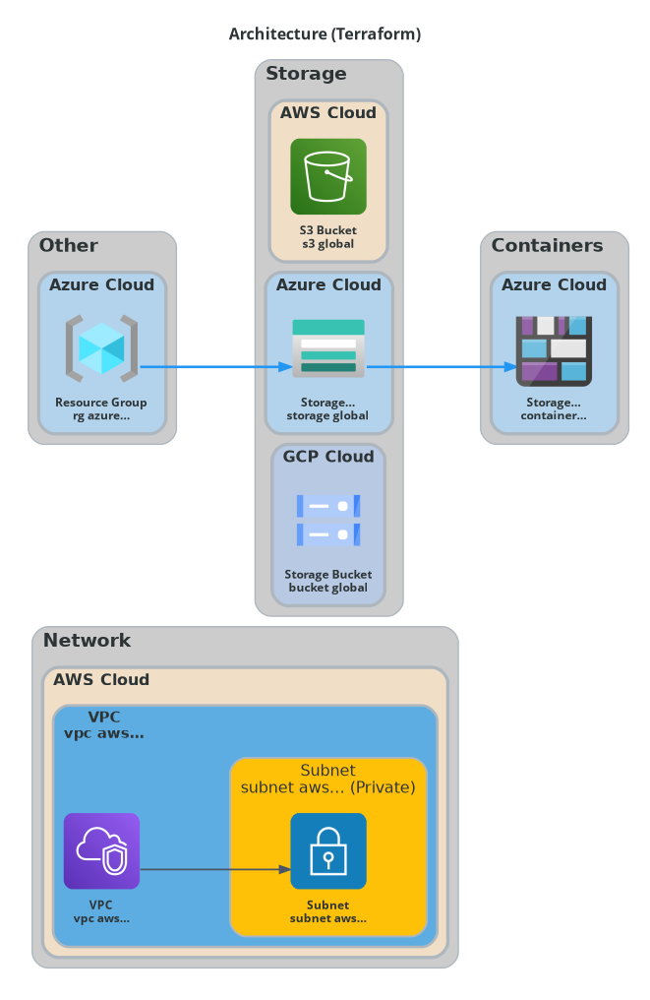

# MLOps Multi-Cloud Architecture

Enterprise MLOps pipeline spanning AWS, Azure, and GCP with 47 resources demonstrating cross-cloud integration patterns.



## Features

- **Multi-Cloud Integration**: AWS (training) + Azure (inference) + GCP (data)
- **AWS**: SageMaker training, S3 model registry, Step Functions orchestration
- **Azure**: AKS cluster for serving, Container Registry, Cosmos DB logging
- **GCP**: BigQuery feature store, Dataflow processing, Cloud Functions validation
- **Cross-Cloud**: AWS SNS → GCP Pub/Sub, Azure → AWS model deployment
- **Professional Styling**: Provider-specific colors, cross-cloud dotted lines

## Architecture Overview

```
GCP (Data Layer)
└── BigQuery Feature Store ← Cloud Functions (validation)
└── Cloud Storage Data Lake ← Dataflow (processing)
└── Pub/Sub Events

       ↓ (data flow)

AWS (Training Layer)
└── SageMaker Training ← Step Functions (orchestration)
└── S3 Model Registry ← Lambda (preprocessing)
└── DynamoDB Experiments

       ↓ (model artifacts)

Azure (Inference Layer)
└── AKS Cluster (serving) ← Container Registry
└── Cosmos DB (logs) ← Redis Cache
└── Application Gateway (LB)
```

## Resources (47 total)

### AWS (15 resources)
VPC, Subnets, SageMaker, S3, Lambda, Step Functions, DynamoDB, SNS, CloudWatch

### Azure (16 resources)
Virtual Network, Subnets, AKS, Container Registry, Storage Account, Cosmos DB, Redis Cache, Application Gateway, Log Analytics

### GCP (16 resources)
VPC, Subnets, BigQuery, Cloud Storage, Dataflow, Pub/Sub, Cloud Functions, Monitoring

## Generate Diagram

```bash
python tools/generate_arch_diagram.py \
  --iac-root examples/terraform/mlops-multi-cloud \
  --out-png examples/terraform/mlops-multi-cloud/architecture-diagram.png
```
