<!-- auto-arch-diagram -->

## Architecture Diagram (Auto)

Summary: Generated a dependency-oriented Terraform diagram from changed resources.

```mermaid
flowchart LR
subgraph all_AWS[AWS]
  tf_aws_apigatewayv2_api_main["aws_apigatewayv2_api.main"]
  tf_aws_apigatewayv2_integration_api_handler["aws_apigatewayv2_integration.api_handler"]
  tf_aws_apigatewayv2_route_api_handler["aws_apigatewayv2_route.api_handler"]
  tf_aws_apigatewayv2_stage_main["aws_apigatewayv2_stage.main"]
  tf_aws_cloudwatch_log_group_api_logs["aws_cloudwatch_log_group.api_logs"]
  tf_aws_dynamodb_table_notifications["aws_dynamodb_table.notifications"]
  tf_aws_dynamodb_table_orders["aws_dynamodb_table.orders"]
  tf_aws_dynamodb_table_payments["aws_dynamodb_table.payments"]
  tf_aws_iam_role_lambda_role["aws_iam_role.lambda_role"]
  tf_aws_iam_role_policy_lambda_dynamodb_access["aws_iam_role_policy.lambda_dynamodb_access"]
  tf_aws_iam_role_policy_attachment_lambda_basic_execution["aws_iam_role_policy_attachment.lambda_basic_execution"]
  tf_aws_lambda_event_source_mapping_notification_sender_mapping["aws_lambda_event_source_mapping.notification_sender_mapping"]
  tf_aws_lambda_event_source_mapping_order_processor_mapping["aws_lambda_event_source_mapping.order_processor_mapping"]
  tf_aws_lambda_event_source_mapping_payment_processor_mapping["aws_lambda_event_source_mapping.payment_processor_mapping"]
  tf_aws_lambda_function_api_handler["aws_lambda_function.api_handler"]
  tf_aws_lambda_function_notification_sender["aws_lambda_function.notification_sender"]
  tf_aws_lambda_function_order_processor["aws_lambda_function.order_processor"]
  tf_aws_lambda_function_payment_processor["aws_lambda_function.payment_processor"]
  tf_aws_lambda_permission_api_gateway["aws_lambda_permission.api_gateway"]
  tf_aws_sns_topic_email_notifications["aws_sns_topic.email_notifications"]
  tf_aws_sns_topic_notification_events["aws_sns_topic.notification_events"]
  tf_aws_sns_topic_order_events["aws_sns_topic.order_events"]
  tf_aws_sns_topic_payment_events["aws_sns_topic.payment_events"]
  tf_aws_sns_topic_subscription_order_to_queue["aws_sns_topic_subscription.order_to_queue"]
  tf_aws_sns_topic_subscription_payment_to_queue["aws_sns_topic_subscription.payment_to_queue"]
  tf_aws_sqs_queue_order_dlq["aws_sqs_queue.order_dlq"]
  tf_aws_sqs_queue_order_queue["aws_sqs_queue.order_queue"]
  tf_aws_sqs_queue_payment_dlq["aws_sqs_queue.payment_dlq"]
  tf_aws_sqs_queue_payment_queue["aws_sqs_queue.payment_queue"]
  tf_aws_sqs_queue_policy_order_queue["aws_sqs_queue_policy.order_queue"]
  tf_aws_sqs_queue_policy_payment_queue["aws_sqs_queue_policy.payment_queue"]
end
tf_aws_apigatewayv2_api_main --> tf_aws_apigatewayv2_integration_api_handler
tf_aws_apigatewayv2_api_main --> tf_aws_apigatewayv2_route_api_handler
tf_aws_apigatewayv2_api_main --> tf_aws_apigatewayv2_stage_main
tf_aws_apigatewayv2_api_main --> tf_aws_lambda_permission_api_gateway
tf_aws_apigatewayv2_integration_api_handler --> tf_aws_apigatewayv2_route_api_handler
tf_aws_dynamodb_table_notifications --> tf_aws_iam_role_policy_lambda_dynamodb_access
tf_aws_dynamodb_table_notifications --> tf_aws_lambda_function_notification_sender
tf_aws_dynamodb_table_orders --> tf_aws_iam_role_policy_lambda_dynamodb_access
tf_aws_dynamodb_table_orders --> tf_aws_lambda_function_api_handler
tf_aws_dynamodb_table_orders --> tf_aws_lambda_function_order_processor
tf_aws_dynamodb_table_payments --> tf_aws_iam_role_policy_lambda_dynamodb_access
tf_aws_dynamodb_table_payments --> tf_aws_lambda_event_source_mapping_notification_sender_mapping
tf_aws_dynamodb_table_payments --> tf_aws_lambda_function_payment_processor
tf_aws_iam_role_lambda_role --> tf_aws_iam_role_policy_attachment_lambda_basic_execution
tf_aws_iam_role_lambda_role --> tf_aws_iam_role_policy_lambda_dynamodb_access
tf_aws_iam_role_lambda_role --> tf_aws_lambda_function_api_handler
tf_aws_iam_role_lambda_role --> tf_aws_lambda_function_notification_sender
tf_aws_iam_role_lambda_role --> tf_aws_lambda_function_order_processor
tf_aws_iam_role_lambda_role --> tf_aws_lambda_function_payment_processor
tf_aws_iam_role_policy_lambda_dynamodb_access --> tf_aws_lambda_event_source_mapping_notification_sender_mapping
tf_aws_iam_role_policy_lambda_dynamodb_access --> tf_aws_lambda_event_source_mapping_order_processor_mapping
tf_aws_iam_role_policy_lambda_dynamodb_access --> tf_aws_lambda_event_source_mapping_payment_processor_mapping
tf_aws_lambda_function_api_handler --> tf_aws_apigatewayv2_integration_api_handler
tf_aws_lambda_function_api_handler --> tf_aws_lambda_permission_api_gateway
tf_aws_lambda_function_notification_sender --> tf_aws_lambda_event_source_mapping_notification_sender_mapping
tf_aws_lambda_function_order_processor --> tf_aws_lambda_event_source_mapping_order_processor_mapping
tf_aws_lambda_function_payment_processor --> tf_aws_lambda_event_source_mapping_payment_processor_mapping
tf_aws_sns_topic_email_notifications --> tf_aws_iam_role_policy_lambda_dynamodb_access
tf_aws_sns_topic_email_notifications --> tf_aws_lambda_function_notification_sender
tf_aws_sns_topic_notification_events --> tf_aws_iam_role_policy_lambda_dynamodb_access
tf_aws_sns_topic_notification_events --> tf_aws_lambda_function_payment_processor
tf_aws_sns_topic_order_events --> tf_aws_iam_role_policy_lambda_dynamodb_access
tf_aws_sns_topic_order_events --> tf_aws_lambda_function_api_handler
tf_aws_sns_topic_order_events --> tf_aws_sns_topic_subscription_order_to_queue
tf_aws_sns_topic_order_events --> tf_aws_sqs_queue_policy_order_queue
tf_aws_sns_topic_payment_events --> tf_aws_iam_role_policy_lambda_dynamodb_access
tf_aws_sns_topic_payment_events --> tf_aws_lambda_function_order_processor
tf_aws_sns_topic_payment_events --> tf_aws_sns_topic_subscription_payment_to_queue
tf_aws_sns_topic_payment_events --> tf_aws_sqs_queue_policy_payment_queue
tf_aws_sqs_queue_order_dlq --> tf_aws_sqs_queue_order_queue
tf_aws_sqs_queue_order_queue --> tf_aws_iam_role_policy_lambda_dynamodb_access
tf_aws_sqs_queue_order_queue --> tf_aws_lambda_event_source_mapping_order_processor_mapping
tf_aws_sqs_queue_order_queue --> tf_aws_sns_topic_subscription_order_to_queue
tf_aws_sqs_queue_order_queue --> tf_aws_sqs_queue_policy_order_queue
tf_aws_sqs_queue_payment_dlq --> tf_aws_sqs_queue_payment_queue
tf_aws_sqs_queue_payment_queue --> tf_aws_iam_role_policy_lambda_dynamodb_access
tf_aws_sqs_queue_payment_queue --> tf_aws_lambda_event_source_mapping_payment_processor_mapping
tf_aws_sqs_queue_payment_queue --> tf_aws_sns_topic_subscription_payment_to_queue
tf_aws_sqs_queue_payment_queue --> tf_aws_sqs_queue_policy_payment_queue
```

Assumptions: Connections represent inferred references (including depends_on and attribute references).

Rendered diagram: available as workflow artifact

## AI Architecture Insights

*Reviewed by OpenRouter free vision model `stealth/ox-alpha` (quality score: 4/10).*

**End-to-end flow:** Clients hit `apigatewayv2_stage.main`, routed to `api_handler` Lambda, which writes orders, payments, and notifications to three DynamoDB tables. Domain events (`order_events`, `payment_events`) fan out over SNS; `order_to_queue` and `payment_to_queue` subscriptions bridge them into SQS queues consumed asynchronously by `order_processor` and `payment_processor` via event source mappings. Failures dead-letter into `order_dlq` / `payment_dlq`. `notification_sender` emits emails through `email_notifications`. All four functions share `lambda_role`, scoped by `lambda_dynamodb_access`; `api_logs` captures request logging.

**Context hints**
- `[COMPUTE]` api_handler Lambda serves API Gateway traffic and persists records to orders table.
- `[GENERAL]` payment_events topic fans out to payment_queue via subscription payment_to_queue.
- `[COMPUTE]` order_processor and payment_processor poll their queues through event source mappings.
- `[DATA]` Failed messages from payment_queue and order_queue land in payment_dlq, order_dlq.
- `[IAM]` lambda_role plus lambda_dynamodb_access policy grants all four Lambdas DynamoDB access.
- `[GENERAL]` notification_sender delivers customer emails through email_notifications SNS topic.

**Contextual labels applied:** `apigatewayv2_api.main` → HTTP API Entry Point, `lambda_function.api_handler` → Request Handler, `lambda_function.payment_processor` → Payment Queue Consumer, `lambda_function.order_processor` → Order Queue Consumer, `lambda_function.notification_sender` → Email Notifier, `dynamodb_table.payments` → Payments Store (+5 more)

**Review notes**
- [labeling] Multiple node labels truncated ('Sns Topic...', 'Lambda Event Source...', 'Apigatewayv2...'), hiding resource identity.
- [edge-routing] Dashed red IAM/policy edges converge densely on Security group, causing heavy crossings and unreadable bundles.
- [grouping] All SNS/SQS messaging resources sit under 'Other' instead of a dedicated Messaging group.
- [layout] Long cross-group edges between Data, Compute, and Other span the full canvas, fragmenting flow reading order.
- [completeness] cloudwatch_log_group.api_logs floats disconnected; its relationship to apigatewayv2_stage.main is not shown.

Feedback iterations: iter0: 3/10, iter1: 4/10, iter2: 4/10, iter3: 4/10

**AI-refined diagram files** (include legend and review hints): architecture-diagram-ai.png, architecture-diagram-ai.jpg, architecture-diagram-ai.svg
