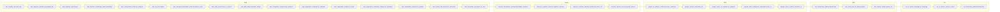

<!-- auto-arch-diagram -->

## Architecture Diagram (Auto)

Summary: Generated a dependency-oriented Terraform diagram from changed resources.

```mermaid
flowchart LR
subgraph all_AWS[AWS]
  tf_aws_amplify_app_web_app["aws_amplify_app.web_app"]
  tf_aws_appsync_graphql_api_graphql_api["aws_appsync_graphql_api.graphql_api"]
  tf_aws_bedrock_agent_agent["aws_bedrock_agent.agent"]
  tf_aws_bedrock_knowledge_base_knowledge["aws_bedrock_knowledge_base.knowledge"]
  tf_aws_comprehend_entity_nlp_analysis["aws_comprehend_entity.nlp_analysis"]
  tf_aws_lex_bot_chatbot["aws_lex_bot.chatbot"]
  tf_aws_managed_blockchain_node_blockchain_node["aws_managed_blockchain_node.blockchain_node"]
  tf_aws_polly_speech_text_to_speech["aws_polly_speech.text_to_speech"]
  tf_aws_qldb_ledger_quantum_ledger["aws_qldb_ledger.quantum_ledger"]
  tf_aws_rekognition_image_image_analysis["aws_rekognition_image.image_analysis"]
  tf_aws_sagemaker_endpoint_ml_endpoint["aws_sagemaker_endpoint.ml_endpoint"]
  tf_aws_sagemaker_model_ml_model["aws_sagemaker_model.ml_model"]
  tf_aws_sagemaker_notebook_instance_ml_notebook["aws_sagemaker_notebook_instance.ml_notebook"]
  tf_aws_sagemaker_pipeline_ml_pipeline["aws_sagemaker_pipeline.ml_pipeline"]
  tf_aws_textract_document_text_extraction["aws_textract_document.text_extraction"]
  tf_aws_transcribe_job_speech_to_text["aws_transcribe_job.speech_to_text"]
end
subgraph all_Azure[Azure]
  tf_azurerm_blockchain_member_blockchain_member["azurerm_blockchain_member.blockchain_member"]
  tf_azurerm_cognitive_account_cognitive_services["azurerm_cognitive_account.cognitive_services"]
  tf_azurerm_machine_learning_workspace_azure_ml["azurerm_machine_learning_workspace.azure_ml"]
  tf_azurerm_openai_account_openai_service["azurerm_openai_account.openai_service"]
end
subgraph all_GCP[GCP]
  tf_google_ai_platform_notebook_vertex_notebook["google_ai_platform_notebook.vertex_notebook"]
  tf_google_automl_model_auto_ml["google_automl_model.auto_ml"]
  tf_google_vertex_ai_endpoint_ai_endpoint["google_vertex_ai_endpoint.ai_endpoint"]
  tf_google_video_intelligence_annotation_video_ai["google_video_intelligence_annotation.video_ai"]
  tf_google_vision_product_set_vision_ai["google_vision_product_set.vision_ai"]
end
subgraph all_IBM[IBM]
  tf_ibm_blockchain_platform_blockchain["ibm_blockchain_platform.blockchain"]
  tf_ibm_cloud_pak_for_data_analytics["ibm_cloud_pak_for_data.analytics"]
  tf_ibm_watson_studio_watson_ml["ibm_watson_studio.watson_ml"]
end
subgraph all_OCI[OCI]
  tf_oci_ai_service_language_ai_language["oci_ai_service_language.ai_language"]
  tf_oci_ai_service_vision_ai_vision["oci_ai_service_vision.ai_vision"]
  tf_oci_blockchain_platform_blockchain["oci_blockchain_platform.blockchain"]
end
tf_aws_amplify_app_web_app --> tf_aws_appsync_graphql_api_graphql_api
tf_aws_appsync_graphql_api_graphql_api --> tf_aws_bedrock_agent_agent
tf_aws_bedrock_agent_agent --> tf_aws_bedrock_knowledge_base_knowledge
tf_aws_bedrock_knowledge_base_knowledge --> tf_aws_comprehend_entity_nlp_analysis
tf_aws_comprehend_entity_nlp_analysis --> tf_aws_lex_bot_chatbot
tf_aws_lex_bot_chatbot --> tf_aws_managed_blockchain_node_blockchain_node
tf_aws_managed_blockchain_node_blockchain_node --> tf_aws_polly_speech_text_to_speech
tf_aws_polly_speech_text_to_speech --> tf_aws_qldb_ledger_quantum_ledger
tf_aws_qldb_ledger_quantum_ledger --> tf_aws_rekognition_image_image_analysis
tf_aws_rekognition_image_image_analysis --> tf_aws_sagemaker_endpoint_ml_endpoint
tf_aws_sagemaker_endpoint_ml_endpoint --> tf_aws_sagemaker_model_ml_model
tf_aws_sagemaker_model_ml_model --> tf_aws_sagemaker_notebook_instance_ml_notebook
tf_aws_sagemaker_notebook_instance_ml_notebook --> tf_aws_sagemaker_pipeline_ml_pipeline
tf_aws_sagemaker_pipeline_ml_pipeline --> tf_aws_textract_document_text_extraction
tf_aws_textract_document_text_extraction --> tf_aws_transcribe_job_speech_to_text
tf_aws_transcribe_job_speech_to_text --> tf_azurerm_blockchain_member_blockchain_member
tf_azurerm_blockchain_member_blockchain_member --> tf_azurerm_cognitive_account_cognitive_services
tf_azurerm_cognitive_account_cognitive_services --> tf_azurerm_machine_learning_workspace_azure_ml
tf_azurerm_machine_learning_workspace_azure_ml --> tf_azurerm_openai_account_openai_service
tf_azurerm_openai_account_openai_service --> tf_google_ai_platform_notebook_vertex_notebook
tf_google_ai_platform_notebook_vertex_notebook --> tf_google_automl_model_auto_ml
tf_google_automl_model_auto_ml --> tf_google_vertex_ai_endpoint_ai_endpoint
tf_google_vertex_ai_endpoint_ai_endpoint --> tf_google_video_intelligence_annotation_video_ai
tf_google_video_intelligence_annotation_video_ai --> tf_google_vision_product_set_vision_ai
tf_google_vision_product_set_vision_ai --> tf_ibm_blockchain_platform_blockchain
tf_ibm_blockchain_platform_blockchain --> tf_ibm_cloud_pak_for_data_analytics
tf_ibm_cloud_pak_for_data_analytics --> tf_ibm_watson_studio_watson_ml
tf_ibm_watson_studio_watson_ml --> tf_oci_ai_service_language_ai_language
tf_oci_ai_service_language_ai_language --> tf_oci_ai_service_vision_ai_vision
tf_oci_ai_service_vision_ai_vision --> tf_oci_blockchain_platform_blockchain
```

Assumptions: Connections represent inferred references (including depends_on and attribute references).

Rendered diagram: available as workflow artifact

## AI Architecture Insights

*Reviewed by OpenRouter free vision model `stealth/ox-alpha` (quality score: 5/10).*

A single directed chain spans five clouds. Amplify **web_app** serves users through **graphql_api**; Bedrock **agent** consults **knowledge**, Comprehend **nlp_analysis** feeds the Lex **chatbot**, whose events reach **blockchain_node**, Polly **text_to_speech**, and the QLDB **quantum_ledger**. Rekognition **image_analysis** and SageMaker **ml_endpoint**/**ml_model** (built in **ml_notebook**, orchestrated by **ml_pipeline**) continue into Textract and Transcribe, then Azure OpenAI/Cognitive, GCP Vertex/AutoML/Vision, IBM Watson/Cloud Pak, and OCI AI/Blockchain services. The uniform sequence reflects generated dependency ordering, not proven dataflow; no IAM, network, or storage tiers exist.

**Context hints**
- `[COMPUTE]` web_app user traffic enters via graphql_api GraphQL interface
- `[DATA]` agent answers using knowledge; nlp_analysis entities feed chatbot
- `[GENERAL]` chatbot events hit blockchain_node; text_to_speech audio logs to quantum_ledger
- `[COMPUTE]` image_analysis inputs scored by ml_endpoint serving ml_model
- `[DATA]` ml_notebook and ml_pipeline orchestrate text_extraction, speech_to_text jobs
- `[GENERAL]` openai_service, auto_ml, watson_ml, ai_vision continue cross-cloud processing

**Contextual labels applied:** `web_app` → Public Web Frontend, `graphql_api` → Managed GraphQL API, `agent` → Conversational AI Agent, `knowledge` → RAG Knowledge Base, `nlp_analysis` → Entity Extraction Service, `chatbot` → Voice Chatbot (+6 more)

**Review notes**
- [labeling] Multiple node labels truncate mid-word: 'Sagemaker Notebook...', 'Bedrock Knowledge...', 'Managed Blockchain...', 'Machine Learning...'.
- [grouping] 'Compute' and 'Data' clusters nest duplicate 'AWS Cloud' subgroups, fragmenting the top-level AWS provider group.
- [edge-routing] Inter-cloud edges become dotted segments crossing group borders; transcribe_job to blockchain_member takes a long upward detour.
- [layout] Extreme horizontal aspect ratio with a large empty band beneath the provider row.
- [completeness] No legend distinguishes solid intra-cloud edges from dotted inter-cloud edges.

Feedback iterations: iter0: 5/10, iter1: 4/10, iter2: 4/10

**AI-refined diagram files** (include legend and review hints): architecture-diagram-ai.png, architecture-diagram-ai.jpg, architecture-diagram-ai.svg
