<!-- auto-arch-diagram -->

## Architecture Diagram (Auto)

Summary: Generated a dependency-oriented Terraform diagram from changed resources.

```mermaid
flowchart LR
  subgraph all_AWS[AWS]
    tf_aws_amplify_app_web_app["aws_amplify_app.web_app"]
    tf_aws_appsync_graphql_api_graphql_api["aws_appsync_graphql_api.graphql_api"]
    tf_aws_bedrock_agent_agent["aws_bedrock_agent.agent"]
    tf_aws_bedrock_knowledge_base_knowledge["aws_bedrock_knowledge_base.knowledge"]
    tf_aws_comprehend_entity_nlp_analysis["aws_comprehend_entity.nlp_analysis"]
    tf_aws_lex_bot_chatbot["aws_lex_bot.chatbot"]
    tf_aws_managed_blockchain_node_blockchain_node["aws_managed_blockchain_node.blockchain_node"]
    tf_aws_polly_speech_text_to_speech["aws_polly_speech.text_to_speech"]
    tf_aws_qldb_ledger_quantum_ledger["aws_qldb_ledger.quantum_ledger"]
    tf_aws_rekognition_image_image_analysis["aws_rekognition_image.image_analysis"]
    tf_aws_sagemaker_endpoint_ml_endpoint["aws_sagemaker_endpoint.ml_endpoint"]
    tf_aws_sagemaker_model_ml_model["aws_sagemaker_model.ml_model"]
    tf_aws_sagemaker_notebook_instance_ml_notebook["aws_sagemaker_notebook_instance.ml_notebook"]
    tf_aws_sagemaker_pipeline_ml_pipeline["aws_sagemaker_pipeline.ml_pipeline"]
    tf_aws_textract_document_text_extraction["aws_textract_document.text_extraction"]
    tf_aws_transcribe_job_speech_to_text["aws_transcribe_job.speech_to_text"]
  end
  subgraph all_Azure[Azure]
    tf_azurerm_blockchain_member_blockchain_member["azurerm_blockchain_member.blockchain_member"]
    tf_azurerm_cognitive_account_cognitive_services["azurerm_cognitive_account.cognitive_services"]
    tf_azurerm_machine_learning_workspace_azure_ml["azurerm_machine_learning_workspace.azure_ml"]
    tf_azurerm_openai_account_openai_service["azurerm_openai_account.openai_service"]
  end
  subgraph all_GCP[GCP]
    tf_google_ai_platform_notebook_vertex_notebook["google_ai_platform_notebook.vertex_notebook"]
    tf_google_automl_model_auto_ml["google_automl_model.auto_ml"]
    tf_google_vertex_ai_endpoint_ai_endpoint["google_vertex_ai_endpoint.ai_endpoint"]
    tf_google_video_intelligence_annotation_video_ai["google_video_intelligence_annotation.video_ai"]
    tf_google_vision_product_set_vision_ai["google_vision_product_set.vision_ai"]
  end
  subgraph all_IBM[IBM]
    tf_ibm_blockchain_platform_blockchain["ibm_blockchain_platform.blockchain"]
    tf_ibm_cloud_pak_for_data_analytics["ibm_cloud_pak_for_data.analytics"]
    tf_ibm_watson_studio_watson_ml["ibm_watson_studio.watson_ml"]
  end
  subgraph all_OCI[OCI]
    tf_oci_ai_service_language_ai_language["oci_ai_service_language.ai_language"]
    tf_oci_ai_service_vision_ai_vision["oci_ai_service_vision.ai_vision"]
    tf_oci_blockchain_platform_blockchain["oci_blockchain_platform.blockchain"]
  end
tf_aws_amplify_app_web_app --> tf_aws_appsync_graphql_api_graphql_api
tf_aws_appsync_graphql_api_graphql_api --> tf_aws_bedrock_agent_agent
tf_aws_bedrock_agent_agent --> tf_aws_bedrock_knowledge_base_knowledge
tf_aws_bedrock_knowledge_base_knowledge --> tf_aws_comprehend_entity_nlp_analysis
tf_aws_comprehend_entity_nlp_analysis --> tf_aws_lex_bot_chatbot
tf_aws_lex_bot_chatbot --> tf_aws_managed_blockchain_node_blockchain_node
tf_aws_managed_blockchain_node_blockchain_node --> tf_aws_polly_speech_text_to_speech
tf_aws_polly_speech_text_to_speech --> tf_aws_qldb_ledger_quantum_ledger
tf_aws_qldb_ledger_quantum_ledger --> tf_aws_rekognition_image_image_analysis
tf_aws_rekognition_image_image_analysis --> tf_aws_sagemaker_endpoint_ml_endpoint
tf_aws_sagemaker_endpoint_ml_endpoint --> tf_aws_sagemaker_model_ml_model
tf_aws_sagemaker_model_ml_model --> tf_aws_sagemaker_notebook_instance_ml_notebook
tf_aws_sagemaker_notebook_instance_ml_notebook --> tf_aws_sagemaker_pipeline_ml_pipeline
tf_aws_sagemaker_pipeline_ml_pipeline --> tf_aws_textract_document_text_extraction
tf_aws_textract_document_text_extraction --> tf_aws_transcribe_job_speech_to_text
tf_aws_transcribe_job_speech_to_text --> tf_azurerm_blockchain_member_blockchain_member
tf_azurerm_blockchain_member_blockchain_member --> tf_azurerm_cognitive_account_cognitive_services
tf_azurerm_cognitive_account_cognitive_services --> tf_azurerm_machine_learning_workspace_azure_ml
tf_azurerm_machine_learning_workspace_azure_ml --> tf_azurerm_openai_account_openai_service
tf_azurerm_openai_account_openai_service --> tf_google_ai_platform_notebook_vertex_notebook
tf_google_ai_platform_notebook_vertex_notebook --> tf_google_automl_model_auto_ml
tf_google_automl_model_auto_ml --> tf_google_vertex_ai_endpoint_ai_endpoint
tf_google_vertex_ai_endpoint_ai_endpoint --> tf_google_video_intelligence_annotation_video_ai
tf_google_video_intelligence_annotation_video_ai --> tf_google_vision_product_set_vision_ai
tf_google_vision_product_set_vision_ai --> tf_ibm_blockchain_platform_blockchain
tf_ibm_blockchain_platform_blockchain --> tf_ibm_cloud_pak_for_data_analytics
tf_ibm_cloud_pak_for_data_analytics --> tf_ibm_watson_studio_watson_ml
tf_ibm_watson_studio_watson_ml --> tf_oci_ai_service_language_ai_language
tf_oci_ai_service_language_ai_language --> tf_oci_ai_service_vision_ai_vision
tf_oci_ai_service_vision_ai_vision --> tf_oci_blockchain_platform_blockchain
```

Assumptions: Connections represent inferred references (including depends_on and attribute references).

Rendered diagram: available as workflow artifact
