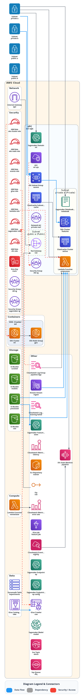
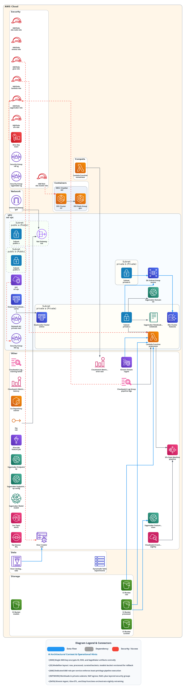

# MLOps + AIOps on AWS — Integration Boilerplate

Copy this `integration_example/` folder as the starting point for your own
project. It shows how to keep an architecture diagram, PR comments, and a
Confluence page automatically in sync using the reusable workflow.

## Architecture Previews

| Standard Diagram (`docs/architecture.png`) | Gemini AI-Enhanced (`docs/architecture-ai.png`) |
|:---:|:---:|
| [](docs/architecture.html) | [](docs/architecture-ai.html) |
| [🌐 Standard HTML Studio ↗](docs/architecture.html) • [💾 .drawio](docs/architecture.drawio) • [📐 .svg](docs/architecture.svg) | [🌐 AI-Enhanced Studio ↗](docs/architecture-ai.html) • [💾 .drawio](docs/architecture-ai.drawio) • [📐 .svg](docs/architecture-ai.svg) |

**AI Enhancements (Gemini 3.1 Flash Lite):**
- **Executive Framing:** Adds *"Enterprise Scalable MLOps Data Platform"* title and operational subtitle.
- **Operational Flows:** Numbered step annotations detailing data ingestion, feature store access, and model training.
- **Context Badges:** Highlights KMS CMK encryption, auto-scaling boundaries, and data retention policies.

## What's inside

```
integration_example/
├── main.tf                         # Realistic MLOps/AIOps stack (VPC → S3 → Glue → SageMaker/EKS → CloudWatch AIOps)
├── variables.tf / outputs.tf
├── .auto-arch-diagram.yml          # Publish paths → docs/architecture.{md,mmd,png,jpg,svg,drawio,html} + AI suite
└── .github/workflows/architecture.yml  # Boilerplate GitHub workflow (copy to your repo's .github/workflows/)
    └── docs/                       # Generated standard & AI-enhanced outputs (committed, so PRs show the diff)
```

**IaC highlights (realistic tags, naming, governance):**

- **Provider default_tags** — `Project`, `Environment` (dev/staging/prod), `Team` (ml-platform), `CostCenter`, `ManagedBy`, `Owner` on every resource.
- **Network:** VPC, 2× public + 2× private subnets, NAT GW, EIP, SGs, NACLs — shows VPC topology.
- **Storage / Lake:** 4× S3 buckets (raw / processed / curated / models) + versioning, all tagged with `Purpose`.
- **Feature store:** Aurora MySQL + `aws_db_subnet_group`, ElastiCache Redis + `aws_elasticache_subnet_group`, DynamoDB experiments.
- **ETL:** Glue DB/crawler/job + Kinesis stream.
- **Compute:** EKS (GPU node group) + ECR, 2× Lambda (preprocess + AIOps remediator).
- **Orchestration:** Step Functions pipeline + EventBridge rule (`aws_cloudwatch_event_target`) + SQS DLQ + Kinesis→Lambda (`aws_lambda_event_source_mapping`).
- **SageMaker:** Domain, Feature Group, Model, Endpoint Config/Endpoint, Notebook.
- **AIOps:** CloudWatch log group + metric alarms + log metric filter, KMS, SNS topic + 2 subscriptions + `aws_lambda_permission`, all wired for auto-remediation.
- **IAM:** Roles + `aws_iam_role_policy_attachment` / `aws_iam_policy_attachment` (plumbing, not diagram nodes).

## Quick start (new repo)

```bash
# 1. Copy the boilerplate
cp -r integration_example /path/to/your-new-repo
cd /path/to/your-new-repo

# 2. Wire the workflow — copy the example workflow into your repo's workflows:
mkdir -p .github/workflows
cp integration_example/.github/workflows/architecture.yml .github/workflows/architecture.yml

# 3. (Optional) Smart Confluence Architecture Portal:
#   Secrets:  CONFLUENCE_URL, CONFLUENCE_USER, CONFLUENCE_TOKEN, GEMINI_API_KEY (or OPENROUTER_API_KEY)
#   Variable: CONFLUENCE_PAGE_ID  (target Confluence page ID)
#   Then set publish_confluence: true and confluence_smart: true in the workflow.

# 4. Push — the workflow runs on push/PR and on manual dispatch:
git add .
git commit -m "chore: add MLOps/AIOps stack with auto-arch diagram"
git push
```

After the first push, check:

- **PR comment:** the workflow posts a sticky comment with the Mermaid + PNG preview on every PR that touches `integration_example/**/*.tf`.
- **Artifacts:** `integration_example/docs/architecture.{png,svg,drawio,html,md,mmd,jpg}` and `architecture-ai.{png,svg,drawio,html,md}` are updated. The `drawio` is fully editable with native AWS shapes; `html` is the interactive studio (pan/zoom, path tracing, inspect drawer).
- **Smart Confluence:** if `CONFLUENCE_PAGE_ID` is set and `publish_confluence: true`, the entire page is transformed into an executive **Architecture Documentation Portal** featuring an AI workload narrative, FinOps cost analysis, Well-Architected assessment, and multi-format attachments (`.drawio`, `.html`, `.svg`, `.png`).

## Workflow — what it does

`integration_example/.github/workflows/architecture.yml`:

```yaml
- uses: suryakumaran2611/auto-arch-diagram/.github/workflows/reusable-auto-arch-diagram.yml@main
  with:
    iac_root: integration_example   # only scan this folder
    out_dir: integration_example/docs
    image_formats: png,jpg,svg       # + drawio + html always
    direction: AUTO
    comment_on_pr: true              # sticky PR comment
    publish_enabled: true            # writes to publish.paths in .auto-arch-diagram.yml
    publish_confluence: true         # publish to Confluence
    confluence_smart: true           # 🚀 Enable Smart Confluence AI Portal
    confluence_page_id: ${{ vars.CONFLUENCE_PAGE_ID }}
    ai_enhance: true                 # AI Vision Refinement
    ai_backend: gemini               # gemini | openrouter
    gemini_model: gemini-3.1-flash-lite
```

Key inputs (all crystal-clear in the reusable):

- **Outputs:** `out_dir`, `out_*`, `image_formats` — seven core formats plus `*-ai.*` when `ai_enhance: true`.
- **AI Vision Refinement:** `ai_enhance`, `ai_backend` (`gemini`/`openrouter`/`ollama`/`bedrock`/`restapi`), `gemini_model` (`gemini-3.1-flash-lite`), `ai_iterations` — automated visual ergonomics & flow annotations.
- **Smart Confluence:** `publish_confluence`, `confluence_smart`, `confluence_page_id`, `confluence_replace` — publishes living architecture wiki portal with FinOps and Well-Architected reviews.
- **Rendering:** `direction`, `render_layout` (`lanes`/`providers`), `render_bg`, `edge_color`/`edge_penwidth`/`edge_arrowsize`, `fontsize`/`iconsize`.

See `../.github/workflows/reusable-auto-arch-diagram.yml` for the full input catalogue.

## Local preview & AI generation

```bash
python -m venv .venv && source .venv/bin/activate
pip install -r requirements.txt

# Standard + Gemini AI-Enhanced Generation:
export GEMINI_API_KEY="your-gemini-key"
python tools/generate_arch_diagram.py \
  --changed-files integration_example/main.tf \
  --out-md integration_example/docs/architecture.md \
  --out-mmd integration_example/docs/architecture.mmd \
  --out-png integration_example/docs/architecture.png \
  --out-svg integration_example/docs/architecture.svg \
  --out-drawio integration_example/docs/architecture.drawio \
  --out-html integration_example/docs/architecture.html \
  --ai-enhance \
  --ai-backend gemini \
  --gemini-model gemini-3.1-flash-lite
```

## Customising

- Change `var.project` / `var.environment` / `var.region` in `variables.tf`.
- Add/remove resources in `main.tf` — the diagram updates automatically.
- Tweak `.auto-arch-diagram.yml` `publish.paths` if you prefer different output locations.
- Set `confluence_smart: true` to auto-publish living architecture portals to Confluence on main branch pushes.
